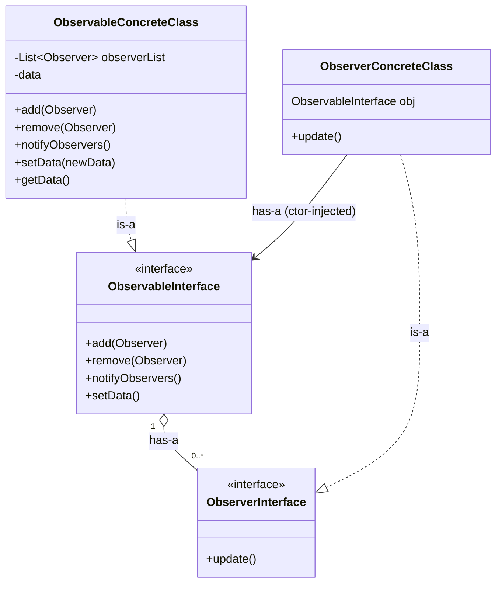
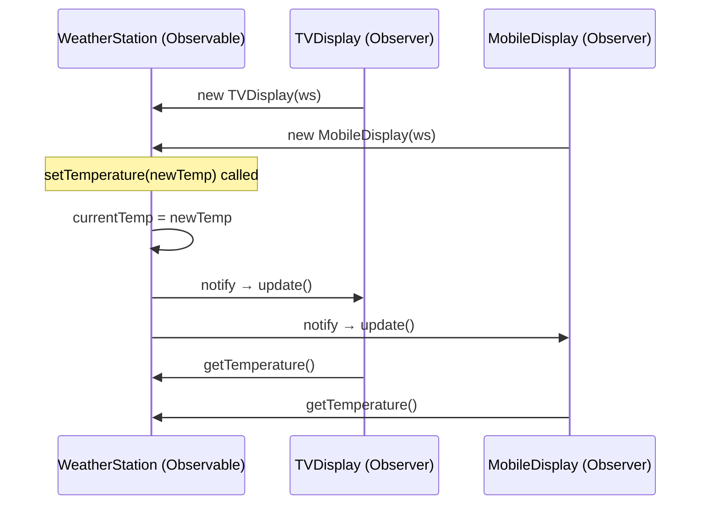
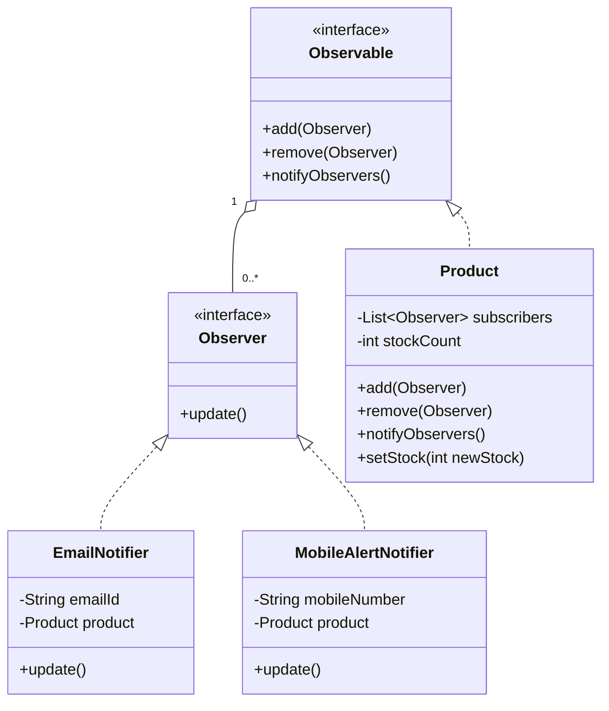
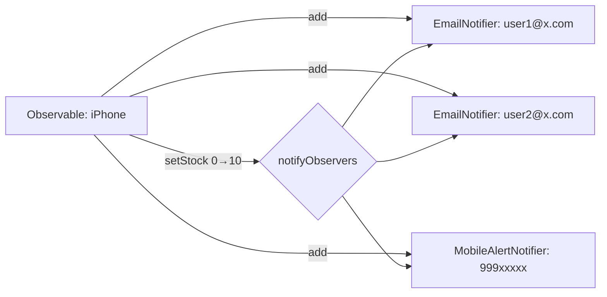

#walmart

> [!tldr] Observer Pattern defines a one-to-many dependency between objects so that when one object (Subject/Observable) changes state, all its dependents (Observers) are notified and updated automatically — without the Subject needing to know their concrete types.

## 1. Why This Pattern Exists (The Problem)

> **Interview question (asked at Walmart):** On an e-commerce site (think Amazon), a product page shows "Notify Me" when an item is **out of stock**. When the item becomes available again, every user who clicked "Notify Me" should be alerted automatically.

This is the textbook use case for the **Observer Pattern** — a **behavioral** pattern that defines a **one-to-many dependency**: when one object's state changes, all dependent objects are notified automatically, without the subject needing to know _who_ they are or _how many_ there are.

Real-world analogs: stock/price alerts, YouTube channel subscriptions, pub-sub systems (Kafka), UI data-binding, event listeners in GUIs.

> 💡 One relevant external note worth flagging: a write-up on long polling in Node.js observes that the Observer pattern is exactly the mechanism a server can use to watch for data changes and push updates to clients — same core idea as the notification use case here, just applied to server↔client polling instead of subject↔observer objects.

---

## 2. Core Actors

|Role|Also known as|Responsibility|
|---|---|---|
|**Observable**|Subject|Holds state, maintains list of observers, notifies them on change|
|**Observer**|Subscriber / Listener|Reacts when notified — implements `update()`|

**Cardinality:** `Observable 1 ---- * Observer` (one subject, many observers)




---

**Two "has-a" relationships to notice — this is the part most write-ups get wrong:**`

1. `ObservableConcreteClass` **has-a** `List<ObserverInterface>` (0..\*) — the subscriber list lives in the **concrete class**, not the interface

> **Why not put the list in the interface?** An interface can only declare method signatures (and constants) — it cannot hold mutable, per-instance state. In Java specifically, any field declared in an interface is implicitly `public static final`, i.e. a compile-time constant shared across every implementation, not a per-object mutable list. Since the whole point of `objList` is that each `ObservableConcreteClass` instance (e.g., each `Product`) tracks its *own* growing/shrinking set of subscribers, it must be a normal instance field on the concrete class. `ObservableInterface` only ever declares the *contract* (`add`, `remove`, `notify`, `setData`) — never the storage.


2. `ObserverConcreteClass` **has-a** a reference to `ObservableInterface` (single instance) — **the interface, not the concrete class**. This works cleanly because `getData()` is part of `ObservableInterface`'s own contract (alongside `add`/`remove`/`notify`/`setData`), so `update()` can call `obj.getData()` through the interface type without ever needing to know the concrete subject class. This reference is set once, via constructor injection, when the concrete observer is created (see §4)

 > **Why this matters (Dependency Inversion in action):** because `obj` is typed as `ObservableInterface` rather than `ObservableConcreteClass`, the same `ObserverConcreteClass` (e.g. `EmailNotifier`) can be pointed at *any* implementation of `ObservableInterface` — the real `Product`, a different concrete subject, or a test double — without touching the observer's code. Typing it as the concrete class instead would silently reintroduce tight coupling between the two sides, defeating the purpose of injecting through the interface in the first place.


## 3. The Key Design Decision: How Does `update()` Get Data?

It's the difference between a textbook-correct implementation and a _clean_ one.

### ❌ Naive approach: pass the Observable into `update()`

```java
interface Observer {
    void update(Observable source);
}
```

**Problem:** if multiple concrete Observable types exist (WeatherStation, CricketScore, StockTicker...), the observer has to do:

```java
public void update(Observable source) {
    if (source instanceof WeatherStation ws) {
        // use ws.getTemperature()
    } else if (source instanceof CricketScore cs) {
        // use cs.getScore()
    }
}
```

`instanceof` chains inside `update()` = code smell, violates Open/Closed Principle, gets worse with every new Observable type.

### ✅ Better approach: Constructor Injection

Give each concrete Observer a reference to the specific Observable it cares about **at construction time** (same idea as the Strategy Pattern's constructor injection).

```java
class MobileDisplay implements Observer {
    private WeatherStation weatherStation; // injected once

    public MobileDisplay(WeatherStation ws) {
        this.weatherStation = ws;
    }

    public void update() {
        int temp = weatherStation.getTemperature(); // no casting needed
        System.out.println("Mobile display: " + temp);
    }
}
```

---
## 4. Worked Example #1 — Weather Station (Generic)

**Scenario:** `WeatherStation` polls temperature periodically. `TVDisplay` and `MobileDisplay` should update whenever temperature changes.



Key implementation points from the transcript:

- `WeatherStation` implements `Observable`: holds `List<Observer>`, `currentTemperature`.
- `setTemperature(newTemp)` → updates state → calls `notifyObservers()`.
- Good practice (mentioned in passing): only call `notifyObservers()` if the value **actually changed** — don't spam observers on a no-op update.
- `TVDisplay` / `MobileDisplay` implement `Observer`; each takes a `WeatherStation` reference via constructor
- Because of constructor injection, `update()` needs **zero parameters**.

---

## 5. Worked Example #2 — Walmart "Notify Me" (The Actual Interview Answer)

**Mapping the problem to the pattern:**

|Generic pattern|This problem|
|---|---|
|Observable|`Product` (e.g., `iPhoneStock`)|
|Observer|`Notifier` (multiple flavors)|
|State that changes|`stockCount`|
|Trigger for notify|stock transitions from `0` → `> 0`|



### Critical business-logic nuance (easy to miss, interviewers probe this)

> Notifications should fire **once**, on the transition from unavailable → available — not on every stock update thereafter. This is the "0 → positive" check inside `setStock()`. Skipping this check is the most common mistake candidates make — it results in spamming users on every subsequent restock.

```
stockCount:   0  →  10        (fires notify — was OOS, now available)
stockCount:  10  →  15        (no notify — was already available)
stockCount:  15  →  0         (no notify in this design — only OOS→available fires;
                                could extend the pattern to also notify "back to OOS"
                                if the business needs it)
```

---

## 6. Notification Fan-out (Multi-channel)

A single "Notify Me" click can subscribe a user via **either** Email **or** Mobile (or both) — modeled simply by instantiating the right `Observer` subclass and injecting it into `Product`. No changes needed to `Product` itself — this is the pattern's core value: **Observable is closed for modification, open for extension** (new observer types can be added freely).



## 7. Common Pitfalls (Interview Red Flags)

- [ ] Forgetting the **state-transition check** (notifying on every update instead of only on the meaningful transition).
- [ ] Passing the Observable into `update()` and then doing `instanceof` — prefer constructor injection.
- [ ] Not supporting `remove()` — real systems need unsubscribe (e.g., user turns off notifications).
- [ ] Tight coupling — Observable directly referencing concrete Observer classes instead of the interface.
- [ ] Synchronous notification blocking the subject if some observer's `update()` is slow (e.g., a real email send) — worth mentioning async/queue-based notification as a follow-up if the interviewer pushes on scale.


---

## 8. Related Patterns

- [[Strategy Pattern]] — same constructor-injection trick used here to avoid `instanceof`.
- Pub/Sub messaging systems (Kafka, event buses) — same conceptual pattern at system/infra scale rather than in-process objects.
- Could pair with **Bulkhead Isolation** or **Circuit Breaker** if the notifier calls external services (email/SMS gateway) that might fail — don't let a slow/broken notifier channel block the whole notify loop.
