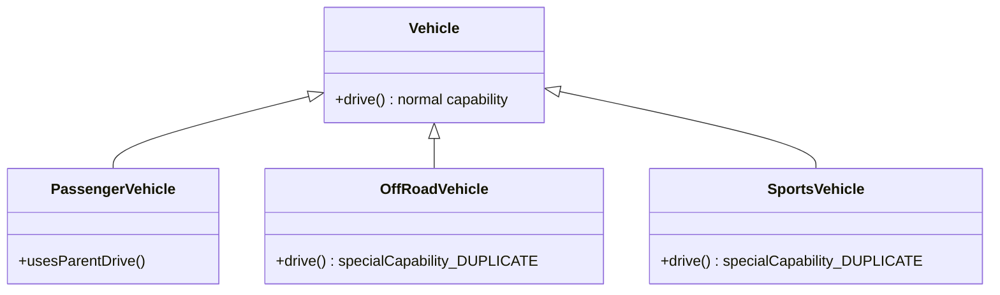
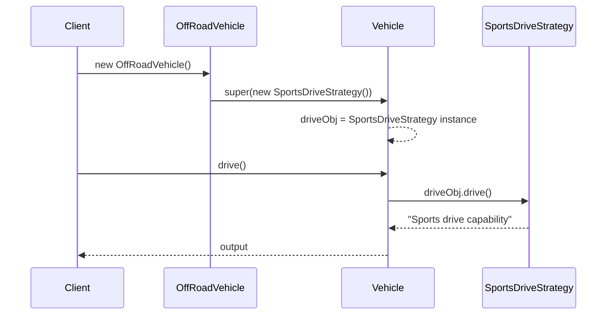

> [!tldr] This pattern solves a very specific problem: *sibling classes needing the same "special" behavior, but that behavior isn't in the common parent* → leads to **code duplication** in plain inheritance. Strategy fixes this by **composition over inheritance** ("has-a" instead of "is-a" for behavior).

## The Problem — Plain Inheritance (Without Strategy Pattern)

### Scenario

- Base class `Vehicle` has a `drive()` method with **normal drive capability** implemented directly in it.
- Children: `PassengerVehicle`, `OffRoadVehicle`, `SportsVehicle` — all `extends Vehicle`.

### What goes wrong

- `PassengerVehicle` → happy with parent's normal `drive()` → no override needed. ✅ Fine.
- `OffRoadVehicle` → needs **special drive logic** → overrides `drive()`, writes its own code.
- `SportsVehicle` → **also** needs the *same* special drive logic → overrides `drive()` again, **duplicating** `OffRoadVehicle`'s code.

> [!danger] Root Cause
> As long as capability flows **strictly parent → child** and each child's need is unique, inheritance is fine.
> The moment **two or more sibling children need the *same* capability that the parent doesn't have**, you're forced to **duplicate code** across those siblings — because there's no shared place (other than the parent, which would pollute it for everyone) to put it.
> 
> This gets worse as the system **scales**: more features (drive, display, fuel-capacity...) × more child classes = **duplication grows combinatorially**.

### Without Strategy Pattern

> [!bug] Symptom
>  - Code Reusability ❌ — same logic copy-pasted in multiple children.
>  - Scalability ❌ — every new sibling with the same special need = more duplication.
>  - Violates **DRY** and **Open/Closed Principle**.

## The Fix — Strategy Design Pattern

### Key Idea

Instead of stuffing all behavior variants into the base class (or duplicating in children), **extract the varying behavior into its own interface + concrete implementations**, and let `Vehicle` **hold a reference** to it (composition), injected via constructor.

### Building Blocks

1. **`DriveStrategy` interface** → declares `drive()`.
2. **Concrete strategies** → `NormalDriveStrategy`, `SportsDriveStrategy`, (future) `XYZDriveStrategy`, each implementing its own `drive()` logic independently.
3. **`Vehicle`** → `HAS-A DriveStrategy driveObj` (composition), set via **constructor injection**. `Vehicle.drive()` simply **delegates**: `driveObj.drive()`.
4. **Each child** decides *which* strategy object to pass to the parent constructor — the child "owns" the decision, not the parent.

> [!tip] Why constructor injection (not `new NormalDriveStrategy()` inside `Vehicle` itself)
> If `Vehicle` hardcodes which strategy to `new` up, it's bound to one behavior again — not scalable. By receiving the strategy object from whoever constructs the vehicle (the child class), the behavior becomes **dynamic and pluggable** at runtime.

### With Strategy Pattern

![[Pasted image 20260802235420.png]]

## When to use strategy

> [!question] Use it when...
> - You're building a parent-child (inheritance) hierarchy, **AND**
> - Two or more sibling children need **identical functionality** that does **not** exist in the base class, **AND**
> - You expect this set of behaviors to **grow over time** (new drive types, new algorithms, etc.)

