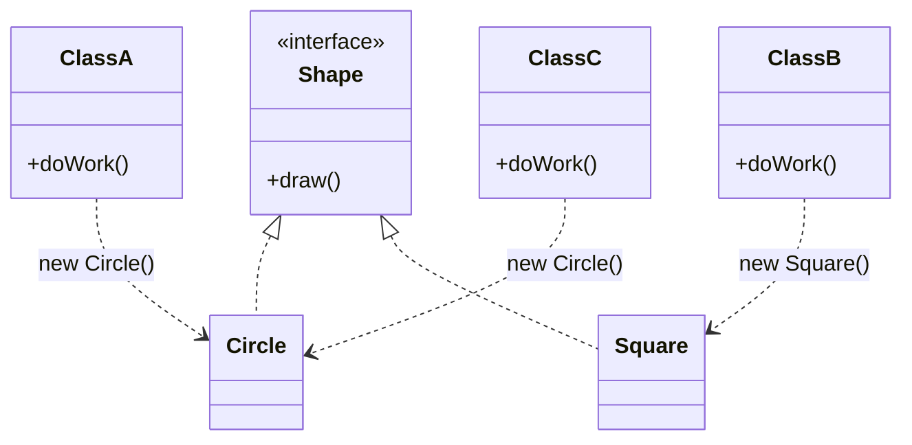
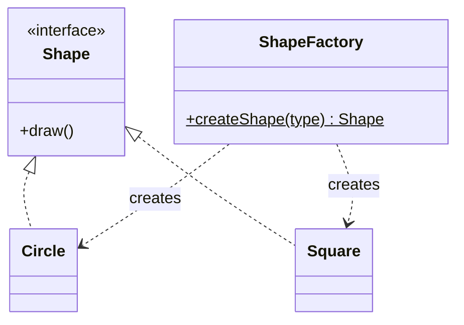
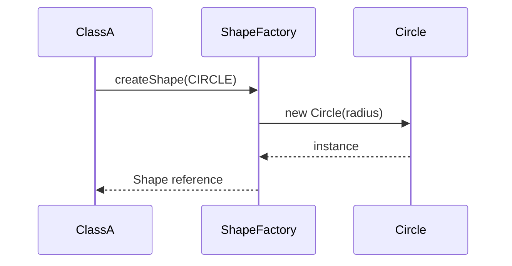
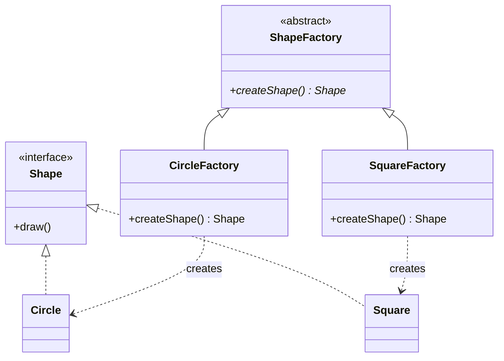
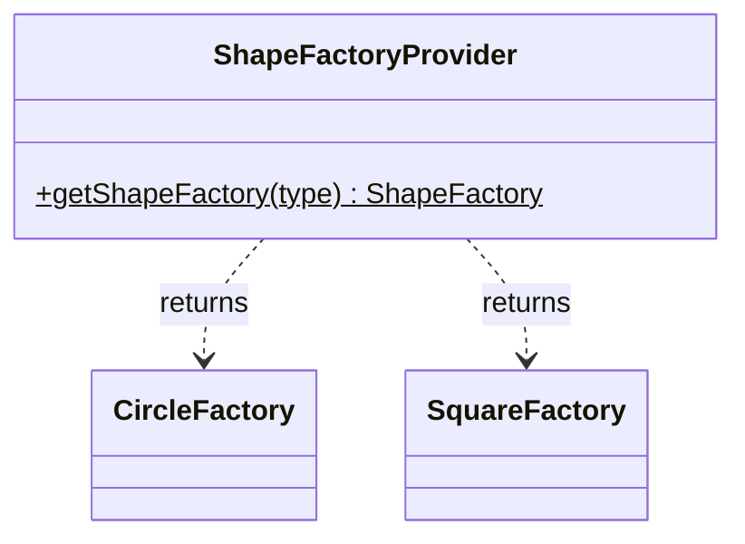
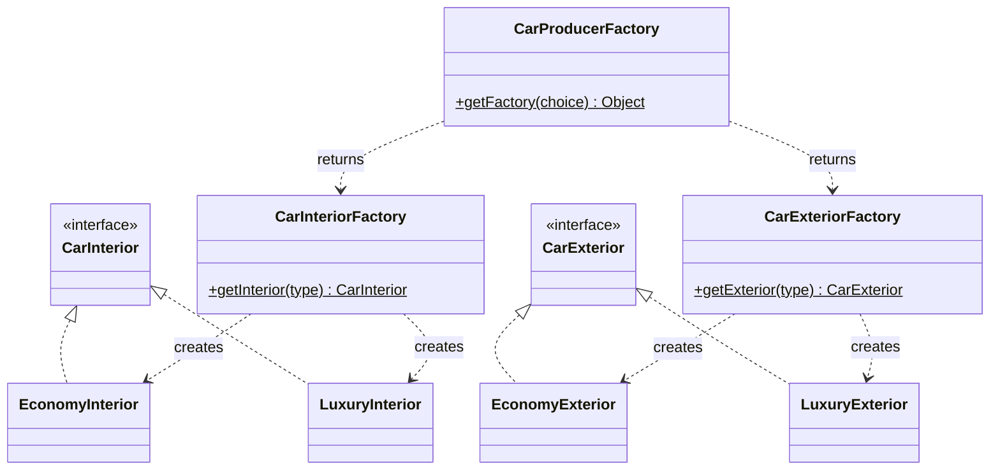
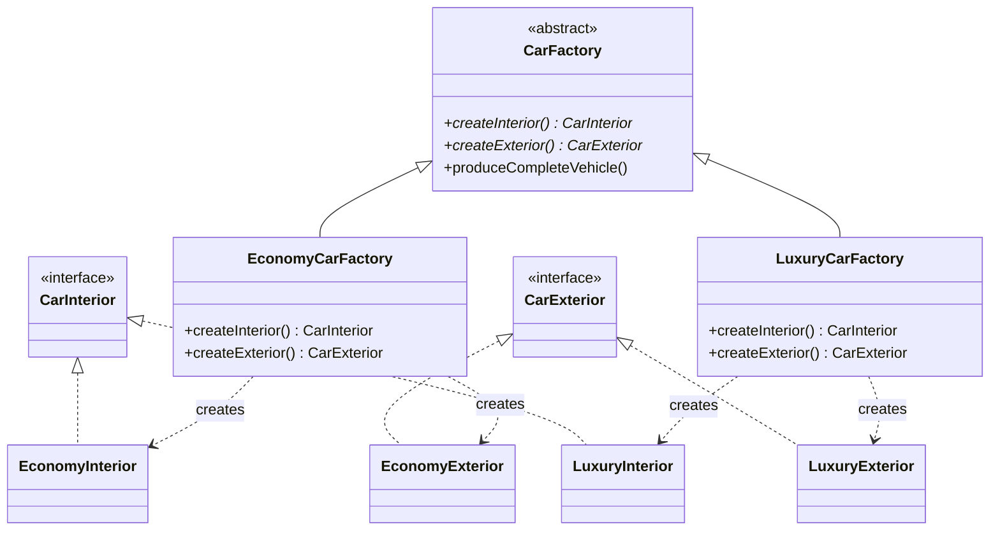
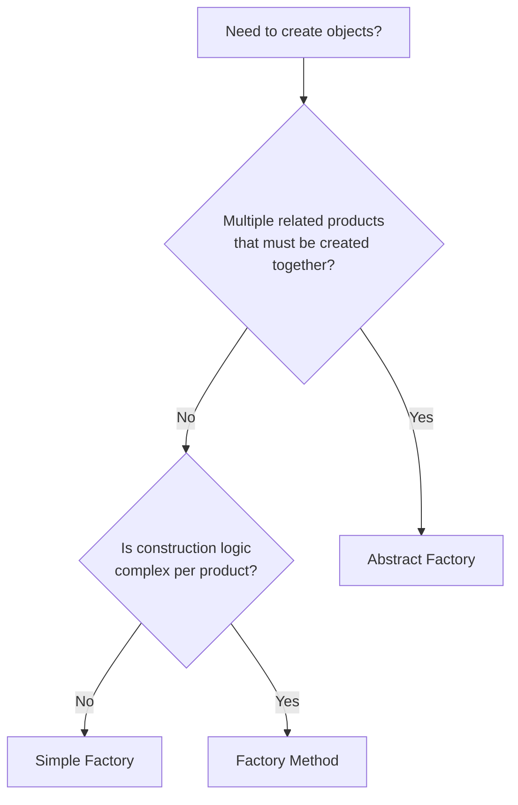

> [!tldr] TL;DR
> 
> - **Simple Factory** — one class, static method, `if-else`/`switch` picks the concrete type. Fast, but violates OCP and SRP.
> - **Factory Method** — one factory _per product_, via inheritance/polymorphism, plus a separate selector. Fixes construction-side SRP/OCP; selection-side OCP violation remains.
> - **Abstract Factory** — "factory of factories." One factory _per family_ of related products, guaranteeing the products it returns are consistent with each other. Can be built on Simple Factory or on Factory Method (the canonical, structurally sound form).
> - All three are creational patterns: they control **who is allowed to say `new`, and where that logic lives.**

---

## 1. The Problem — Object Creation Scattered Across the Codebase

Without a factory, every consumer class instantiates concrete products directly:



`ClassA`, `ClassB`, `ClassC`... every class that needs a shape calls `new Circle()` or `new Square()` directly. The construction logic is **duplicated and spread** across the entire repository.

> [!danger] Why this breaks down The moment `Circle`'s constructor signature changes — say it now requires a `radius` — **every single call site** (`new Circle()` → `new Circle(radius)`) has to be hunted down and changed. This is a maintenance nightmare in a large codebase, and it's exactly the kind of ripple-effect bug that a senior reviewer flags in a design review.

**Fix:** encapsulate object creation and its related logic at a single place. That's the **Factory Pattern** — a creational pattern that controls (and centralizes) object creation.

> [!note] Two flavours — don't let this confuse you
> 
> - **Simple Factory** → what you'll actually see in most production codebases. Not one of the official 23 GoF patterns, but extremely common and pragmatic.
> - **Factory Method** → the "textbook" GoF pattern. Uses inheritance/polymorphism properly.
> 
> Neither is "wrong." It's a trade-off between simplicity and extensibility — pick based on your use case, not because a book said so.

---

## 2. Simple Factory Pattern

### Structure



One factory class, one **static** method, one big `if-else`/`switch` that decides which concrete product to instantiate. It's static because you need to obtain a shape _before_ you have any object to call the method on — there's nothing to invoke it against yet.

### Java

```java
public interface Shape {
    void draw();
}

public class Circle implements Shape {
    private final double radius;
    public Circle(double radius) { this.radius = radius; }
    @Override public void draw() { System.out.println("Drawing circle r=" + radius); }
}

public class Square implements Shape {
    private final double side;
    public Square(double side) { this.side = side; }
    @Override public void draw() { System.out.println("Drawing square side=" + side); }
}

public enum ShapeType { CIRCLE, SQUARE }

public class ShapeFactory {
    // static -> callable without instantiating ShapeFactory itself
    public static Shape createShape(ShapeType type) {
        switch (type) {
            case CIRCLE: return new Circle(5.0);
            case SQUARE: return new Square(4.0);
            default: throw new IllegalArgumentException("Unknown shape type: " + type);
        }
    }
}

// Client
Shape shape = ShapeFactory.createShape(ShapeType.CIRCLE);
shape.draw();
```

> [!tip] Engineering note Use an **`enum`** for the discriminator, not a raw `String`. The transcript mentions "it could be a string, or an enum" — in production, always prefer the enum. It gives you compile-time safety and kills an entire class of typo bugs (`"crcle"` vs `"circle"`) that a `String`-keyed switch will happily let through until runtime.

### What changed for the caller



`ClassA` never calls `new Circle()` again — it always goes through `ShapeFactory.createShape(...)`. If `Circle`'s constructor changes tomorrow, exactly **one file** changes.

### Problems with Simple Factory

|#|Issue|Why it happens|
|---|---|---|
|1|**Violates Open/Closed Principle (OCP)**|Adding `Rectangle` means editing the existing `switch`/`if-else` inside `createShape()`. You are modifying tested, working code to add a new feature.|
|2|**Class can become bloated**|If creation logic is non-trivial (load config, validate, init DB resources, _then_ build the object), all of that piles into one method for every product type.|
|3|**Violates Single Responsibility Principle (SRP)**|`ShapeFactory` is doing **two jobs**: (a) _selection_ — deciding which type to build, and (b) _construction_ — the actual (possibly complex) build logic. Two reasons to change = SRP violation.|

> [!warning] Senior-review flag `createShape()` is a `static` method. Static methods **cannot be overridden** — they're resolved at compile time, not via dynamic dispatch. So Simple Factory, by construction, cannot be extended polymorphically; the _only_ way to add a type is to edit the method body. That's the structural root cause of the OCP violation above, not just a coincidence.

**Use Simple Factory when:** the use case is genuinely simple — a handful of product types, cheap construction, low churn.

---

## 3. Factory Method Pattern

This is the "textbook" (GoF) version. Instead of one fat factory with a big `switch`, **each product gets its own dedicated factory**, and those factories share a common supertype.

### Structure



- `ShapeFactory` is an **abstract class** (not an interface — it may carry shared/default behaviour, and subclasses only need to override `createShape()`).
- `CircleFactory` **extends** `ShapeFactory` and overrides `createShape()` to build a `Circle`.
- `SquareFactory` **extends** `ShapeFactory` and overrides `createShape()` to build a `Square`.

One factory **per** product now — not one factory that knows about _every_ product.

### The selection problem still needs solving

Even with one-factory-per-product, the client still needs to know _which_ factory to ask for. That's handled by a separate **provider/selector**:



### Java

```java
public abstract class ShapeFactory {
    // Factory Method — overridden by each concrete factory
    public abstract Shape createShape();
}

public class CircleFactory extends ShapeFactory {
    @Override
    public Shape createShape() {
        return new Circle(5.0);   // complex creation logic lives ONLY here
    }
}

public class SquareFactory extends ShapeFactory {
    @Override
    public Shape createShape() {
        return new Square(4.0);   // complex creation logic lives ONLY here
    }
}

public class ShapeFactoryProvider {
    public static ShapeFactory getShapeFactory(ShapeType type) {
        switch (type) {
            case CIRCLE: return new CircleFactory();
            case SQUARE: return new SquareFactory();
            default: throw new IllegalArgumentException("Unknown shape type: " + type);
        }
    }
}

// Client
ShapeFactory factory = ShapeFactoryProvider.getShapeFactory(ShapeType.CIRCLE);
Shape shape = factory.createShape();
shape.draw();
```

### What actually improved

> [!success] Selection and Construction are now separated
> 
> - **Construction logic** → lives inside `CircleFactory` / `SquareFactory`. Each is independently extensible — solves bloating **and** solves SRP for the _construction_ half.
> - **Selection logic** → still lives in `ShapeFactoryProvider.getShapeFactory()`.

|Responsibility|Simple Factory|Factory Method|
|---|---|---|
|Selection (deciding which type)|Inside `ShapeFactory`|Inside `ShapeFactoryProvider`|
|Construction (building the object)|Inside `ShapeFactory` (same class)|Inside `CircleFactory`/`SquareFactory` (dedicated class per product)|
|SRP|❌ Violated (both in one class)|✅ Construction is isolated; provider still has one job (selection)|
|OCP on construction|❌ Edit the switch to add a type|✅ Add a new `RectangleFactory`, don't touch existing factories|
|OCP on selection|❌ Violated|❌ **Still violated** — `getShapeFactory()` still needs a new `case` for `RECTANGLE`|

> [!warning] Important nuance the transcript is right to call out Factory Method does **not** fully solve OCP. It moves OCP-compliance into the _construction_ side (great), but the _selection_ side (`getShapeFactory`) is still a `switch`/`if-else` that must be edited whenever a new product type is introduced. If you want to close that last gap, you'd typically reach for a **registry/map-based factory** (`Map<ShapeType, Supplier<Shape>>` populated at startup, e.g. via Spring bean scanning) — genuinely OCP-compliant, but adds indirection. Worth knowing this exists even if today's scope stops at Factory Method.

**Use Factory Method when:** construction logic per product is non-trivial, and you want each product's build logic isolated and independently testable.

---

## 4. Abstract Factory Pattern — "Factory of Factories"

Abstract Factory answers a **different question**: not "how do I build one product," but **"how do I build a _family_ of related products that must be consistent with each other."**

> [!note] It can be built two ways Both are seen in industry. Neither is "wrong" — pick based on what you're already using underneath.
> 
> 1. **Abstract Factory built on Simple Factory** — each sub-factory is itself a simple (static) factory.
> 2. **Abstract Factory built on Factory Method** — this is the canonical GoF version, where each concrete factory produces a _whole family_ of related products.

### 4.1 Variant A — Built on Simple Factory

**Scenario:** A car has two independent parts — `Interior` and `Exterior` — each available in `Economy` and `Luxury` variants.



```java
public interface CarInterior { void assemble(); }
public class EconomyInterior implements CarInterior {
    @Override public void assemble() { System.out.println("Economy interior"); }
}
public class LuxuryInterior implements CarInterior {
    @Override public void assemble() { System.out.println("Luxury interior"); }
}

public class CarInteriorFactory {
    public static CarInterior getInterior(String type) {
        if (type.equals("economy")) return new EconomyInterior();
        if (type.equals("luxury"))  return new LuxuryInterior();
        throw new IllegalArgumentException("Unknown interior type: " + type);
    }
}

// CarExterior / CarExteriorFactory mirror the above structure.

// The "factory of factories"
public class CarProducerFactory {
    public static Object getFactory(String choice) {
        if (choice.equals("interior")) return new CarInteriorFactory();
        if (choice.equals("exterior")) return new CarExteriorFactory();
        throw new IllegalArgumentException("Unknown factory choice: " + choice);
    }
}

// Client
CarInterior luxuryInterior = CarInteriorFactory.getInterior("luxury");
```

> [!warning] Senior-review flag on Variant A `CarProducerFactory.getFactory()` returning a raw `Object` (as literally shown in the walkthrough) is a code smell — it forces an unsafe downcast at the call site and throws away compile-time type checking. In real code, use **generics** or, better, have `CarInteriorFactory`/`CarExteriorFactory` both implement a common marker interface so `getFactory()` can return a properly typed reference. This variant is pedagogically useful but isn't the one I'd ship — see 4.2 below, which is structurally sound.

### 4.2 Variant B — Built on Factory Method (canonical GoF form)

This is the one worth internalizing for interviews and real systems. The key shift: instead of one factory per _product type_ (`InteriorFactory`, `ExteriorFactory`), you get one factory per _product family_ (`EconomyCarFactory`, `LuxuryCarFactory`), and each family-factory knows how to build **every** related product in that family.



**The grouping is the whole point.** In plain Factory Method, you'd have `CarInteriorFactory` and `CarExteriorFactory` as two independent, unrelated hierarchies — nothing stops a caller from mixing an `EconomyInterior` with a `LuxuryExterior` by mistake. Abstract Factory eliminates that risk structurally: one call to `EconomyCarFactory` can _only_ ever produce economy-grade parts, together, guaranteed.

```java
public interface CarInterior { void assemble(); }
public interface CarExterior { void assemble(); }

public class EconomyInterior implements CarInterior {
    @Override public void assemble() { System.out.println("Economy interior"); }
}
public class LuxuryInterior implements CarInterior {
    @Override public void assemble() { System.out.println("Luxury interior"); }
}
public class EconomyExterior implements CarExterior {
    @Override public void assemble() { System.out.println("Economy exterior"); }
}
public class LuxuryExterior implements CarExterior {
    @Override public void assemble() { System.out.println("Luxury exterior"); }
}

public abstract class CarFactory {
    public abstract CarInterior createInterior();
    public abstract CarExterior createExterior();

    // template-ish convenience method built on top of the abstract factory methods
    public void produceCompleteVehicle() {
        CarInterior interior = createInterior();
        CarExterior exterior = createExterior();
        interior.assemble();
        exterior.assemble();
    }
}

public class EconomyCarFactory extends CarFactory {
    @Override public CarInterior createInterior() { return new EconomyInterior(); }
    @Override public CarExterior createExterior() { return new EconomyExterior(); }
}

public class LuxuryCarFactory extends CarFactory {
    @Override public CarInterior createInterior() { return new LuxuryInterior(); }
    @Override public CarExterior createExterior() { return new LuxuryExterior(); }
}

// Selection / provider — identical role to ShapeFactoryProvider earlier
public class CarFactoryProvider {
    public static CarFactory getFactory(String carType) {
        if (carType.equals("economy")) return new EconomyCarFactory();
        if (carType.equals("luxury"))  return new LuxuryCarFactory();
        throw new IllegalArgumentException("Unknown car type: " + carType);
    }
}

// Client
CarFactory factory = CarFactoryProvider.getFactory("luxury");
factory.produceCompleteVehicle();   // luxury interior + luxury exterior, guaranteed consistent
```

### Grouping visual — Factory Method vs Abstract Factory

```
Factory Method (one factory per PRODUCT):
    CircleFactory      -> Circle
    SquareFactory      -> Square
    InteriorFactory     -> Economy/Luxury Interior   (still 2 unrelated hierarchies)
    ExteriorFactory     -> Economy/Luxury Exterior

Abstract Factory (one factory per FAMILY):
    EconomyCarFactory  -> Economy Interior + Economy Exterior   (bundled, consistent)
    LuxuryCarFactory   -> Luxury Interior  + Luxury Exterior    (bundled, consistent)
```

> [!success] Rule of thumb for interviews Reach for **Abstract Factory** the moment you catch yourself thinking: _"these two-or-more products must always be created together, from the same variant/family, or the system will be in an inconsistent state."_ If products are independent of each other, plain **Factory Method** is enough — don't over-engineer.

---

## 5. Consolidated Comparison

|Pattern|Selection logic|Construction logic|OCP|SRP|Typical use case|
|---|---|---|---|---|---|
|**Simple Factory**|Same class|Same class|❌|❌|Few product types, cheap construction|
|**Factory Method**|Separate provider class|One factory class **per product**|⚠️ Partial (construction ✅, selection ❌)|✅ (construction)|Complex per-product construction logic|
|**Abstract Factory**|Separate provider class|One factory class **per family**, producing multiple related products|⚠️ Partial (adding a family ✅, selection ❌)|✅|Families of related products that must stay consistent|



---

## 6. Real-World Java/Spring Touchpoints

|API|Pattern|
|---|---|
|`java.sql.DriverManager.getConnection()`|Simple Factory|
|`javax.xml.parsers.DocumentBuilderFactory`|Factory Method|
|`java.util.Calendar.getInstance()`|Factory Method|
|Spring's `BeanFactory` / `ApplicationContext`|Abstract Factory (produces families of collaborating beans configured together)|
|`javax.swing.UIManager` (pluggable Look & Feel: buttons + scrollbars + checkboxes that must match)|Abstract Factory — classic textbook example, same shape as the Economy/Luxury car family here|

---

## 7. Interview Angle

- **"What's the difference between Factory Method and Abstract Factory?"** Factory Method → one product, one factory hierarchy, subclass decides _which concrete type_. Abstract Factory → _multiple related_ products bundled into one factory per family, guaranteeing the products it returns are compatible with each other.
    
- **"Does Factory Method fully satisfy Open/Closed?"** No — only the construction side. The selector/provider (`if-else`/`switch` picking which factory to instantiate) still needs modification for every new type. Say this explicitly if asked; it shows you understand the pattern's real limits, not just its marketing.
    
- **"Why is the Simple Factory's method static, and what does that cost you?"** Called before any object exists, so there's nothing to invoke it on. Cost: static methods can't be overridden, so you lose polymorphic extension — the _only_ lever to add a type is editing the method body directly.
    
- **"When would you NOT use Abstract Factory?"** When products aren't related / don't need to stay consistent as a family. Introducing Abstract Factory for independent products is needless indirection — a classic over-engineering smell in design interviews.
    

---

## 8. Recap

1. **Simple Factory** — one class, static method, `if-else`/`switch`. Fast to write, violates OCP + SRP once things get complex.
2. **Factory Method** — one factory per product (via inheritance + polymorphism), plus a separate provider for selection. Fixes construction-side SRP/OCP; selection-side OCP violation remains.
3. **Abstract Factory** — factory of factories; one factory per **family** of related products, guaranteeing internal consistency across that family. Can be layered on Simple Factory (quick, less type-safe) or on Factory Method (canonical GoF form, structurally sound — prefer this in real systems).
