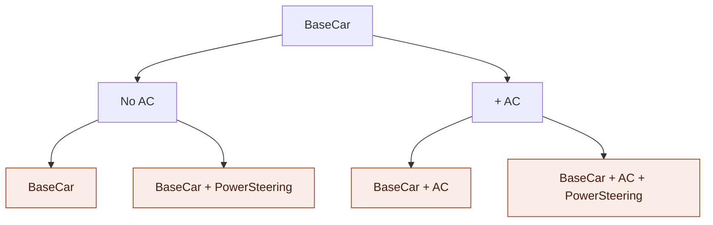
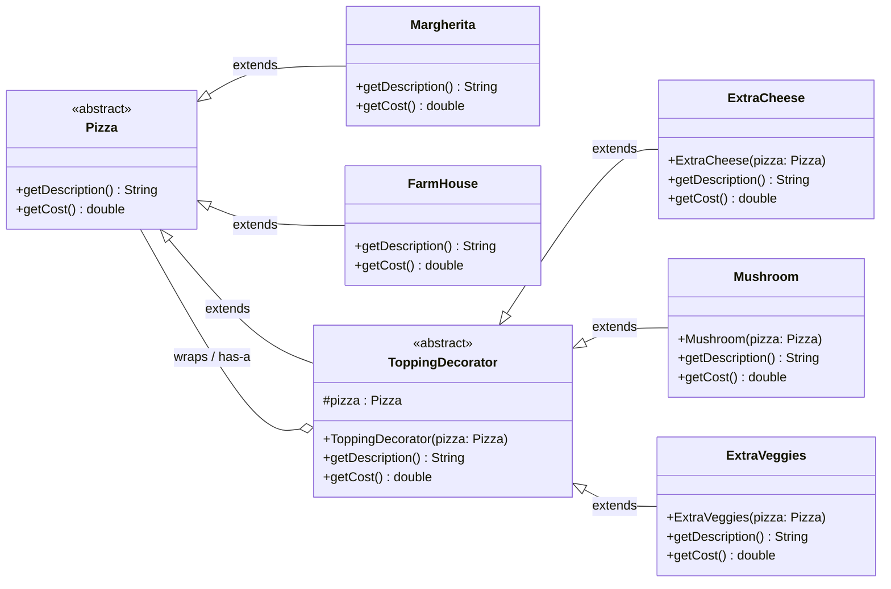

> [!tldr] The **Decorator Pattern** lets you attach new behavior/features to an object **at runtime** by wrapping it inside another object of the same base type — instead of exploding your class hierarchy with one subclass per feature combination.

## 1. Core Idea

- You start with a **base object** that has some default features (`F1`).
- To add a feature, you **wrap** the base object inside a **decorator** — the decorator itself implements the _same interface/abstract type_ as the base object.
- Because the decorator is of the _same type_, it can **itself be wrapped again** by another decorator → decorators can be **stacked indefinitely**
- Each layer **delegates** to the object it wraps, then adds its own bit of behavior on top.

```text
BaseObject (F1)
      │  wrap
      ▼
Decorator1(BaseObject)   → F1 + F2
      │  wrap
      ▼
Decorator2(Decorator1)   → F1 + F2 + F3
      │  wrap
      ▼
Decorator3(Decorator2)   → F1 + F2 + F3 + F4 ...
```

> [!tip] Mental model "An object inside an object inside an object..." — every layer knows how to compute its own result _by asking the layer it wraps first_, then adding its own contribution.

---

## 2. Why Do We Need It? (The Problem It Solves: Class Explosion)

If you tried to model every feature combination using **subclassing**, you'd need a new class for every permutation:

```text
BaseCar
BaseCar+AC
BaseCar+PowerSteering
BaseCar+AC+PowerSteering
BaseCar+AC+PowerSteering+Sunroof
... (combinatorial explosion) 🔥
```

This is called **Class Explosion** — the number of classes grows combinatorially with the number of optional features, making the codebase unmanageable.

### 2.1 The problem, illustrated — `BaseCar` permutations

With just **2 optional features** (`AC`, `PowerSteering`), subclassing already forces **4 concrete classes** — one per leaf of the decision tree:



> [!warning] It gets worse fast Each leaf (highlighted) = one class you must physically write and maintain.
> 
> - 2 optional features → 2² = **4 classes**
> - 3 optional features (add `Sunroof`) → 2³ = **8 classes**
> - 4 optional features → 2⁴ = **16 classes**
> - `n` optional features → **2ⁿ classes** — this is the combinatorial explosion.

### 2.2 How Decorator avoids it — pizza as nested wrapping

Instead of a new class per _combination_, Decorator gives you **one class per feature**, and lets you **wrap** them in any combination/order **at runtim**e — the pizza order below is built from just 2 decorator classes (`ExtraCheese`, `Mushroom`), reused and even repeated:

<svg width="100%" viewBox="0 0 680 440" xmlns="http://www.w3.org/2000/svg"> <circle cx="220" cy="220" r="175" fill="none" stroke="#993C1D" stroke-width="1.5"/> <circle cx="220" cy="220" r="130" fill="none" stroke="#0F6E56" stroke-width="1.5"/> <circle cx="220" cy="220" r="85" fill="none" stroke="#534AB7" stroke-width="1.5"/> <circle cx="220" cy="220" r="40" fill="#D3D1C7" stroke="#5F5E5A" stroke-width="1.5"/> <text x="220" y="220" text-anchor="middle" dominant-baseline="central" font-family="sans-serif" font-size="14" font-weight="600" fill="#2C2C2A">BP</text> <line x1="262" y1="146" x2="450" y2="120" stroke="#888780" stroke-width="1" stroke-dasharray="3 3"/> <circle cx="262" cy="146" r="3" fill="#534AB7"/> <circle cx="460" cy="120" r="4" fill="#534AB7"/> <text x="472" y="120" dominant-baseline="central" font-family="sans-serif" font-size="14" font-weight="600" fill="#26215C">BP + EC</text> <line x1="327" y1="145" x2="450" y2="180" stroke="#888780" stroke-width="1" stroke-dasharray="3 3"/> <circle cx="327" cy="145" r="3" fill="#0F6E56"/> <circle cx="460" cy="180" r="4" fill="#0F6E56"/> <text x="472" y="180" dominant-baseline="central" font-family="sans-serif" font-size="14" font-weight="600" fill="#04342C">BP + EC + M</text> <line x1="391" y1="184" x2="450" y2="240" stroke="#888780" stroke-width="1" stroke-dasharray="3 3"/> <circle cx="391" cy="184" r="3" fill="#993C1D"/> <circle cx="460" cy="240" r="4" fill="#993C1D"/> <text x="472" y="240" dominant-baseline="central" font-family="sans-serif" font-size="14" font-weight="600" fill="#4A1B0C">BP + EC + M + EC</text>

<text x="220" y="410" text-anchor="middle" font-family="sans-serif" font-size="12" fill="#5F5E5A">BP = base pizza, EC = extra cheese, M = mushroom</text> </svg>

> [!tip] Reading the nested-circle diagram Each ring **wraps everything inside it** and adds exactly one feature on top. The outermost ring (`BP + EC + M + EC`) shows the _same_ `ExtraCheese` decorator applied a second time — something subclassing can't do without yet another dedicated class. No matter how many toppings you combine, you never add a new class — only a new _wrap_.

**Decorator Pattern fixes this** because:

- The **base stays fixed** (one class).
- Every optional "topping"/feature becomes a **decorator class**, and features are **composed at runtime** instead of being baked into a fixed class hierarchy at compile time.
- Multiplying/combining decorators is _runtime composition_, not _compile-time inheritance_.


## 3. Real-World / Interview Examples

### 3.1 Pizza Shop 🍕 (classic example)

- Base object: `BasePizza` (e.g., Margherita)
- Toppings = Decorators: `ExtraCheese`, `Mushroom`, etc.
- You can even apply the **same decorator twice** (e.g., double extra cheese).

```text
BasePizza
  → BasePizza + ExtraCheese
    → BasePizza + ExtraCheese + Mushroom
      → BasePizza + ExtraCheese + Mushroom + ExtraCheese (again!)
```

### 3.2 Coffee Machine ☕

- Base object: `BlackCoffee`
- Decorators: `ExtraMilk`, `DoubleCream`, `Sugar(300ml)` etc.
- Also a **very common interview question**: _"Design a Coffee Machine"_ → directly maps to Decorator Pattern.

### 3.3 Car Rental / Showroom 🚗

- Base object: `BaseCar`
- Decorators: `AC`, `PowerSteering`, etc.
- Combine any number of decorators → `BaseCar + AC + PowerSteering`

---

## 4.Mermaid Class Diagram



> [!important] How to read this diagram
> 
> - `Pizza <|-- ToppingDecorator` → **inheritance** (is-a): `ToppingDecorator` is itself a `Pizza`, which is _why it can be wrapped again_.
> - `ToppingDecorator o-- Pizza` → **aggregation/composition** (has-a): every decorator **holds a reference** to a `Pizza` (the object it wraps — could be a concrete pizza OR another decorator).
> - `ExtraCheese`, `Mushroom`, `ExtraVeggies` all extend `ToppingDecorator`, not `Pizza` directly — this is what lets decorators stack on top of each other indefinitely.
> - This **"is-a" + "has-a" combined on the same abstract class** is the structural fingerprint of the Decorator Pattern — spot this in any UML diagram and you know it's Decorator.

---

## 5. Sample Code Walkthrough (Java-style pseudocode from transcript)

```java
// Component
abstract class Pizza {
    abstract String getDescription();
    abstract double getCost();
}

// Concrete Components (base pizzas)
class Margherita extends Pizza {
    String getDescription() { return "Margherita"; }
    double getCost() { return 100; }
}

class FarmHouse extends Pizza {
    double getCost() { return 120; }
}

// Decorator (abstract) — note: also extends Pizza!
abstract class ToppingDecorator extends Pizza {
    protected Pizza pizza;   // <-- the wrapped object (composition)
    ToppingDecorator(Pizza pizza) {
        this.pizza = pizza;
    }
}

// Concrete Decorators
class ExtraCheese extends ToppingDecorator {
    ExtraCheese(Pizza pizza) { super(pizza); }
    double getCost() {
        return pizza.getCost() + 10;   // delegate + add own feature cost
    }
}

class Mushroom extends ToppingDecorator {
    Mushroom(Pizza pizza) { super(pizza); }
    double getCost() {
        return pizza.getCost() + 5;
    }
}
```

### Usage — stacking decorators

```java
Pizza order = new Margherita();                 // base: ₹100
order = new ExtraCheese(order);                  // ₹100 + ₹10 = ₹110
order = new Mushroom(order);                     // ₹110 + ₹5  = ₹115

System.out.println(order.getCost());             // 115
```

### Execution trace (how the call unwinds)

```text
order.getCost()
   └─ Mushroom.getCost()
         └─ ExtraCheese.getCost()
               └─ Margherita.getCost()  → returns 100
            → 100 + 10 (cheese)         → returns 110
      → 110 + 5 (mushroom)              → returns 115
```

> [!important] Execution direction The call **drills down** to the innermost (base) object first, then **bubbles back up**, with each decorator adding its own cost/behavior on the way out. This is essentially a **recursive delegation chain**.

---

## 6. When to Use Decorator Pattern (Interview Signal)

Use it when:

- ✅ You have **one fixed base** and many **optional, combinable add-ons/features**.
- ✅ You want to **avoid class explosion** from subclassing every combination.
- ✅ You need to add responsibilities to _individual objects_ at **runtime**, not to the entire class.
- ✅ Same add-on may need to be **applied multiple times** (e.g., double cheese).

Common interview prompts that map directly to this pattern:

- "Design a Pizza ordering system with toppings"
- "Design a Coffee Machine with customizations" ⭐ (very frequently asked — usually the giveaway that they want Decorator)
- "Design a Car configurator with optional features"
- Notification/Text formatting systems (bold + italic + underline, etc. — classic GoF example, java.io `BufferedReader(new FileReader(...))` style stream wrapping)

---

## 7. Decorator vs Subclassing — Quick Comparison

|Aspect|Subclassing|Decorator Pattern|
|---|---|---|
|When behavior is fixed|Compile-time|Runtime|
|Number of classes needed for N optional features|Up to 2^N (combinatorial)|N decorators (linear)|
|Can apply same feature twice|❌ No|✅ Yes|
|Flexibility to add/remove at runtime|❌ No|✅ Yes|
|Violates Open-Closed Principle?|Often yes (modify hierarchy)|No (extend via composition)|

---

## 8. Key Takeaways

1. Decorator = **wrap an object with another object of the same type**, adding behavior incrementally.
2. Solves **class explosion** from combinatorial subclassing.
3. Structure = **inheritance (is-a) + composition (has-a)** together — decorator both _extends_ the component type and _holds_ an instance of it.
4. Supports **SRP** (each decorator = one concern) and **OCP** (extend without modifying existing classes).
5. Classic interview red flags that point to Decorator: _pizza toppings, coffee customization, car add-ons, stream wrapping._
6. Cost/behavior calculation is a **recursive delegation** — outermost decorator calls inward, then adds on the way back.

