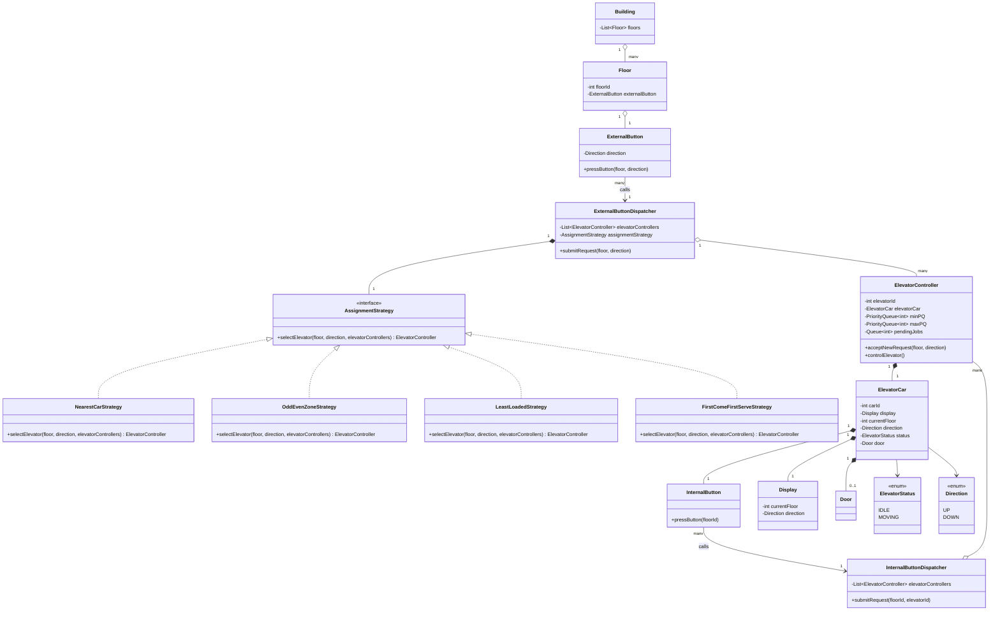
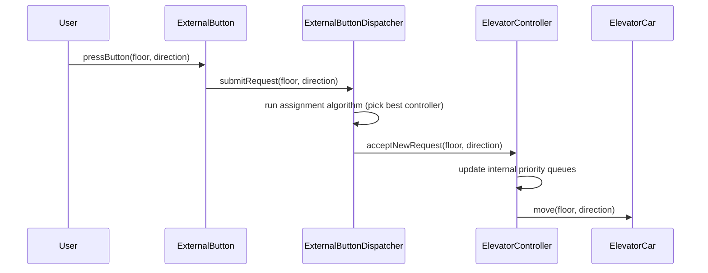
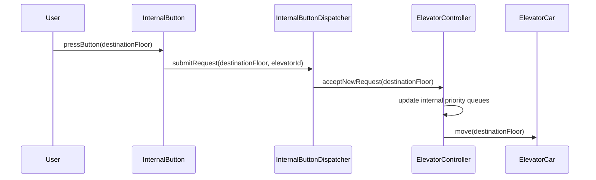

> [!tldr] Designing a multi-elevator system from scratch: requirement gathering, object identification, the **Dispatcher → Controller → Car** control hierarchy, and the two places scheduling logic actually lives (assignment algorithm vs. car-internal SCAN/LOOK algorithm).

---

## 1. Requirement Gathering

Before touching objects, the two clarifying questions that shape the whole design:

- **How many floors does the building have?** (fixes the range of `Floor` values the system reasons about)
- **Can there be more than one elevator?** → Interviewer confirms: **yes, N elevators.**

> [!info] Why this matters The moment you allow N elevators instead of 1, you've introduced a **routing problem** on top of a **scheduling problem**. Single-elevator LLD only needs an internal algorithm (which floor next). Multi-elevator LLD needs an _additional_ layer to decide **which elevator** should even respond to a request — this single clarifying question is what forces the Dispatcher object into existence.

---

## 2. High-Level Objects Identified

Walking the physical system top-down:

- `Building` — has many `Floor`s
- `Floor` — has an `ExternalButton` (up/down)
- `ElevatorCar` — the physical cabin: `Display`, `Door`, `InternalButton`, `Direction`, `Status`
- `ElevatorController` — one per elevator car; owns scheduling _for that car_
- `Dispatcher` (`ExternalDispatcher` + `InternalDispatcher`) — decides _which_ elevator serves a request

---

## 3. Bottom-Up Object Design

### 3.1 `Display`

Smallest, safest place to start — no dependencies.

```
Display
├── currentFloor : int
└── direction    : Direction (enum: UP, DOWN)
```

### 3.2 `ElevatorCar`

> [!info] Design rule stated explicitly: **Keep the ElevatorCar "dumb."** It holds state and exposes primitive commands (`move(floor, direction)`). It does **not** contain any scheduling algorithm. All the "thinking" is pushed into `ElevatorController`.

```
ElevatorCar
├── carId          : int
├── display        : Display
├── currentFloor   : int
├── direction      : Direction
├── status         : ElevatorStatus (enum: MOVING, IDLE)
├── internalButton : InternalButton
└── door           : Door
```

`ElevatorStatus` enum:

```
ElevatorStatus
├── IDLE
└── MOVING
```

> [!info] Why `Door` is optional The transcript explicitly calls out that a `Door` object is a "nice-to-have" — you can drop it for interview simplicity. **Note it out loud to the interviewer** ("I'm simplifying door mechanics for this session") rather than silently omitting it. Simplify for scope, don't skip for laziness — say so.

### 3.3 `InternalButton` (the panel inside the cabin)

```
InternalButton
└── pressButton(floorId) → calls InternalButtonDispatcher.submitRequest(floorId, elevatorId)
```

### 3.4 `ExternalButton` (on each floor, outside the lift)

```
ExternalButton
└── pressButton(floor, direction) → calls ExternalButtonDispatcher.submitRequest(floor, direction)
```

### 3.5 `ElevatorController` — the per-car brain

```
ElevatorController
├── elevatorId        : int
├── elevatorCar        : ElevatorCar   (1:1 — controls exactly one car)
├── minPQ              : PriorityQueue<Integer>   (min-heap — pending UP requests, see §6.3)
├── maxPQ              : PriorityQueue<Integer>   (max-heap — pending DOWN requests, see §6.3)
├── pendingJobs        : Queue<Integer>           (same-direction, position-blocked requests, see §6.3)
├── acceptNewRequest(floor, direction)
└── controlElevator()
```

> [!info] Why these three live on the Controller, not somewhere else This is the direct payoff of the "why a Controller exists" argument below — `minPQ`/`maxPQ`/`pendingJobs` **are** the "per-car scheduling state" that justified introducing `ElevatorController` in the first place. They can't live on `ElevatorCar` (would violate the "keep the car dumb" rule from §3.2), and they can't live on the `Dispatcher` (that's building-wide routing state, not per-car ordering state — see the multiplicity discussion in §3.6). One `ElevatorController` instance per elevator means each car gets its own independent set of these three structures.

> [!info] Why a Controller exists at all — the "why" behind the why A naive design would let `ElevatorCar` accept requests directly. But one elevator can have **many pending requests queued at once** (go up, then down, then up again). Something needs to **own the queue/data-structure of pending requests** and decide ordering. That "something" can't be the dumb car — so `ElevatorController` is introduced purely to own **per-car scheduling state**. This is a clean instance of the checklist: _"does collection membership/ordering change independently of the individual instance's own state?"_ → yes, request ordering is a controller-level concern, not a car-level one.

### 3.6 `InternalButtonDispatcher` / `ExternalButtonDispatcher`

```
InternalButtonDispatcher
├── elevatorControllers : List<ElevatorController>
└── submitRequest(floorId, elevatorId)
        → looks up ElevatorController by elevatorId
        → calls controller.acceptNewRequest(...)

ExternalButtonDispatcher
├── elevatorControllers : List<ElevatorController>
└── submitRequest(floor, direction)
        → runs assignment algorithm across all controllers
        → picks the "best" elevator
        → calls chosenController.acceptNewRequest(...)
```

> [!info] Why two dispatchers, and why the split matters
> 
> - **Internal** request already knows _which_ elevator (you're standing inside it) — dispatching is a pure **lookup by ID**, no algorithm needed.
> - **External** request (hall call) does _not_ know which elevator should come — dispatching requires an **assignment algorithm** (nearest car, odd/even zoning, least-loaded, etc.).
> 
> Separating these two dispatchers means the _external_ assignment algorithm can be swapped independently of internal routing, without touching the car or controller at all. **This is effectively a Strategy-pattern seam** — the transcript doesn't name it explicitly, but the design is: "whatever algorithm I plug in, it just needs to call `acceptNewRequest` on the right controller." That pluggability is the entire point of keeping Dispatcher separate from Controller.

> [!info] Button → Dispatcher: association, not dependency Each `InternalButton`/`ExternalButton` holds its dispatcher reference as an injected **field** (e.g. constructor-injected in a Spring wiring), not a call-time-only parameter — so this is a real structural association, not a transient dependency. Correct multiplicity: **many buttons → one shared dispatcher** (one dispatcher per building), i.e. `"many" --> "1"`. A dashed `..>` would only be correct if the dispatcher reference were passed in fresh per call (e.g. via a static/singleton accessor) rather than held as a field — which isn't how you'd realistically wire this.

### 3.7 `Building`

```
Building
└── floors : List<Floor>

Floor
├── floorId        : int
└── externalButton : ExternalButton
```

---

## 4. Class Diagram



---

## 5. Sequence Diagrams

### 5.1 Hall call (external button pressed on a floor)



### 5.2 Cab call (internal button pressed inside the car)



---

## 6. Algorithm Layer — Two Distinct Problems

> [!info] The two algorithm decision points
> 
> 1. **Dispatcher-level**: _which elevator_ should answer this hall call? (odd/even zoning, nearest-car, least-loaded, first-come-first-serve...)
> 2. **Controller-level**: _given all pending requests for this one car_, in what order should it visit floors? → **this is the classic SCAN/LOOK problem.**

### 6.0 Formalizing the Dispatcher-level algorithm: `AssignmentStrategy`

> [!info] Gap in the original transcript The transcript describes the assignment algorithm only in prose ("odd/even, nearest-car, least-loaded...") — it never gives it a class. Leaving it as an unnamed `if/else` block inside `ExternalButtonDispatcher.submitRequest()` violates Open/Closed the moment a new heuristic is needed (e.g. peak-hour zoning). Pulling it into its own hierarchy lets the dispatcher **delegate** the decision instead of **containing** it — same shape as your earlier Strategy Pattern session.

```
AssignmentStrategy (interface)
└── selectElevator(floor, direction, elevatorControllers) : ElevatorController

NearestCarStrategy          implements AssignmentStrategy
OddEvenZoneStrategy         implements AssignmentStrategy
LeastLoadedStrategy         implements AssignmentStrategy
FirstComeFirstServeStrategy implements AssignmentStrategy
```

```
ExternalButtonDispatcher
├── elevatorControllers : List<ElevatorController>
├── assignmentStrategy   : AssignmentStrategy      (injected, composed 1:1)
└── submitRequest(floor, direction)
        → controller = assignmentStrategy.selectElevator(floor, direction, elevatorControllers)
        → controller.acceptNewRequest(floor, direction)
```

> [!info] Why `interface`, not abstract class No shared mutable state and no partial concrete behavior across strategies — each heuristic is pure decision logic given the same inputs. That rules out abstract class per your earlier heuristic (abstract class only when shared mutable fields + partial concrete behavior + compiler-enforced subtype variation are all present). Interface gives maximum flexibility here.

### 6.1 SCAN algorithm (a.k.a. elevator algorithm)

The car keeps moving in its current direction, picking up every matching request along the way, **all the way to the end of the building**, then reverses.

> [!info] Disadvantage Even if there are **no more pending requests** ahead in the current direction, SCAN still travels to the terminal floor before reversing — wasted travel time.

### 6.2 LOOK algorithm (SCAN's practical fix)

Same idea, but the car "looks ahead" — if there's no pending request further in the current direction, it reverses immediately instead of running to the building's edge.

> [!tldr] SCAN vs LOOK
> 
> ||SCAN|LOOK|
> |---|---|---|
> |Reversal point|Always at building's terminal floor|At the last pending request in that direction|
> |Wasted travel|Yes, when requests are sparse|Minimized|
> |Implementation complexity|Simpler|Needs "peek ahead" check before continuing|
> |Real-world usage|Rare in practice|What most production elevator systems approximate|

### 6.3 Recommended data structure for `ElevatorController`

Three structures — already declared as fields on `ElevatorController` in §3.5, detailed here:

```
minPQ  : Priority Queue (min-heap)  → pending UP-direction floors, reachable ahead of current position
maxPQ  : Priority Queue (max-heap)  → pending DOWN-direction floors, reachable ahead of current position
pendingJobs : Queue → requests in the SAME direction as current travel, but positionally unreachable
              this sweep (the car has already passed that floor)
```

> [!info] Why three structures instead of one sorted list — the actual "why"
> 
> - While moving **UP**, you only care about the _next smallest floor above you_ → min-heap gives O(log n) access to that.
> - While moving **DOWN**, you only care about the _next largest floor below you_ → max-heap.
> - `pendingJobs` is **not** for opposite-direction requests — those go straight into the opposite heap, since the car will pass every floor on its way down/up regardless of current position. `pendingJobs` is specifically for the trickier case: a request in the **same** direction the car is _already_ travelling, but for a floor **behind** the car's current position — e.g. car is going UP, currently at floor 6, and someone at floor 4 presses UP. That request is same-direction but unreachable _this sweep_ (the car would have to reverse to reach floor 4 going up, which defeats the point of the sweep). It can only be served on the **next** UP sweep — so it's parked in `pendingJobs` until then.
> - **At the moment a heap empties out (no more requests ahead in the current direction), drain `pendingJobs` into that _same_ heap** — this pre-loads the next sweep in that direction before the car even gets there, then the car reverses and works off the opposite heap.
> 
> This is the same shape of reasoning as a **two-pointer / merge-direction problem**: same-direction backlog gets queued and replayed into its own heap on the _next_ pass, rather than being force-fit into the current sweep out of order.

### 6.4 Walkthrough (from transcript, floors 1–10, car starts at floor 3)

```
State: direction = UP, currentFloor = 3
minPQ = [5, 6]   (requests for 5 and 6, going up)

→ Serve 5 → Serve 6
→ New request arrives: floor 4, direction UP → same direction, but behind current position (6) → pendingJobs
→ New request arrives: floor 7, direction DOWN → opposite direction → goes straight into maxPQ (reachable once the car reverses)
→ minPQ exhausted, no more UP requests ahead
→ Drain pendingJobs (floor 4, an UP request) into minPQ → pre-loads the *next* UP sweep
→ Reverse direction: DOWN
→ maxPQ = [7] → Serve 7 → continue down
→ [next reversal, back to UP] → minPQ already has 4 waiting from the earlier drain → serve it first
```

> [!info] Key behavioral rule **At the moment a heap empties (no more requests ahead in the current direction), drain `pendingJobs` into that _same_ heap — not the opposite one.** `pendingJobs` always holds same-direction, position-blocked requests; draining them back into their own heap right before reversing means they're already sitting there, correctly sorted, the next time the car swings back into that direction. Opposite-direction requests never touch `pendingJobs` at all — they go straight into the other heap the moment they arrive, since position doesn't block them (the car will pass that floor regardless once it's heading that way).

---

## 7. Engineering Critique (independent read, not just transcript recap)

> [!info] Design smells to flag out loud in an interview

- **`ElevatorCar` as an anemic object is intentional, not lazy** — it's the correct application of "keep volatile/physical state separate from decision logic." If you were tempted to put `controlElevator()` on the car itself, that's the same anti-pattern as putting business logic inside a JPA `@Entity` — state and behavior-that-changes-often should be decoupled.
- **The Dispatcher/Controller split is the scalability lever.** The transcript's closing point is explicit: this structure lets you swap the assignment algorithm (e.g., add zone-based routing for peak-hour traffic) without touching `ElevatorCar` or `ElevatorController` at all — only `ExternalButtonDispatcher` changes. That's Open/Closed Principle in a real interview shape, not just a slogan.
- **Missing from the transcript, worth raising with the interviewer:** concurrency. Multiple hall calls can hit the same `ExternalButtonDispatcher` concurrently — the assignment algorithm reading controller state (current floor, direction, queue depth) while another thread mutates it is a real **TOCTOU-shaped race**, structurally similar to the race-condition discussion from your Observer session. In production you'd need either a per-controller lock or an actor-style single-threaded owner per elevator.
- **`Door` was correctly scoped out — but say why.** Omitting objects without narrating the trade-off reads as an oversight in an interview; omitting them _and stating the simplification_ reads as scoping judgment.
- **Algorithm pluggability is formalized as `AssignmentStrategy` (§6.0).** The transcript only gestures at this verbally ("plug and play the algorithm") without giving it a class — worth stating explicitly if the interviewer asks "how would you make this extensible?"

---

## 8. Open Questions to Carry Forward

- How does `ElevatorController` fairly interleave `minPQ`/`maxPQ` drains when a reversal happens _mid-serve_ (i.e., a request arrives for the current floor exactly as direction flips)?
- Where does **starvation prevention** live if a far hall call keeps losing to closer ones under a naive "nearest car" assignment strategy? (Candidate fix: age-weighted scoring in the assignment algorithm — not covered in this transcript.)