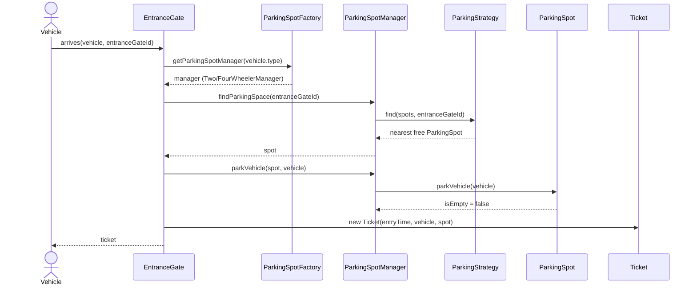
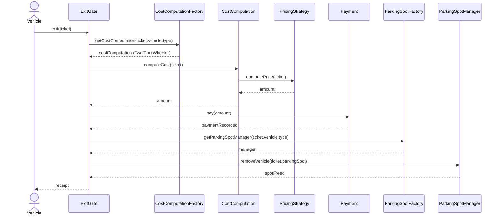
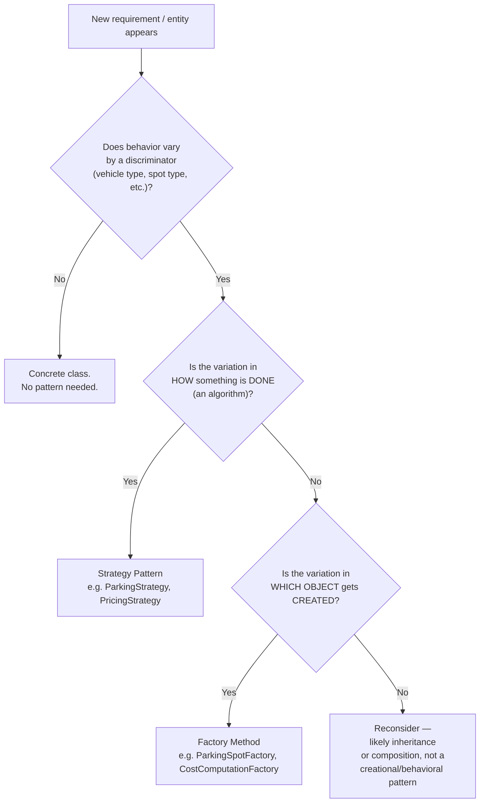

> [!tldr] TL;DR This is the **flagship LLD interview question** (asked at Amazon and most top product companies). It's not really about "knowing" a pattern — it's a test of **process**: can you go from a vague prompt to a scalable, SOLID-compliant class design in ~40 minutes? The two patterns that fall out _naturally_ here are **Factory Method** (picking the right manager/cost-strategy based on vehicle type) and **Strategy** (pluggable spot-finding logic and pluggable pricing logic). Neither is forced — both emerge because the requirements genuinely vary by a discriminator (`VehicleType`), which is the textbook signal for Factory + Strategy working together.

---

## 1. Why This Note Is Structured Differently

Unlike the previous pattern-specific notes (Strategy, Observer, Decorator, Factory Method, Abstract Factory), this transcript is a **full system design walkthrough**, not a single-pattern deep dive. So this note is organized the way you'd actually _run the interview_, not the way you'd document a GoF pattern:

1. Requirement gathering & clarification (the part candidates skip and shouldn't)
2. Object identification (nouns → classes)
3. Bottom-up construction (small objects → composed system)
4. Where patterns emerge organically
5. Independent critique — where the transcript's design has real gaps for production

---

## 2. Phase 1 — Requirement Gathering (Don't Skip This)

> [!warning] The single biggest interview mistake Jumping straight to `class ParkingSpot { }` without asking clarifying questions signals a junior mindset. In a real LLD round, **requirement clarification is graded**, even if it's not stated explicitly. It's also how you scope the problem down to something finishable in 40 minutes.

### 2.1 Clarifying Questions to Ask (and why each one matters)

|Question|Why It Matters|Answer Used in This Design|
|---|---|---|
|How many entrances/exits?|Determines if you need an `EntranceGateManager` / concurrency across gates|1 entrance, 1 exit — but code must be **extensible** to N|
|What types of parking spots exist?|Determines your inheritance hierarchy|Discriminate by **wheel count**, not by vehicle brand (Harley vs normal bike is irrelevant — both are 2-wheelers)|
|Hourly or per-minute billing?|Determines whether pricing needs to be pluggable|**Both** — some spots are hourly, some are per-minute → this alone justifies the Strategy pattern for pricing|
|Are there multiple floors?|Determines whether `ParkingFloor` is a first-class object|Out of scope for this pass, but the design must not preclude adding it later|
|Nearest-spot allocation?|Determines whether "find spot" needs a real algorithm (heap) or a naive scan|Yes — spot should be **nearest to the entrance gate used** (and optionally nearest to an elevator too)|

> [!tip] Interview technique Notice the pattern: almost every clarifying question the video asks maps directly to **"is this thing going to vary?"** If the answer is yes, that's your signal to introduce an abstraction (interface + Strategy or Factory) _there_ — not everywhere, and not nowhere.

### 2.2 Core Objects Identified from the Walkthrough

```text
Vehicle          → number, type (enum: TWO_WHEELER, FOUR_WHEELER, ...)
ParkingSpot       → id, isEmpty, vehicle, price, type
ParkingSpotManager→ owns a list of spots + a spot-finding strategy
Ticket            → entryTime, vehicle, assignedSpot
EntranceGate      → finds a spot, books it, issues a ticket
ExitGate          → computes cost, takes payment, frees the spot
```

---

## 3. Phase 2 — Approach: Bottom-Up vs Top-Down

|Approach|How it works|Trade-off|
|---|---|---|
|**Top-down**|Start from `EntranceGate`, discover dependencies as you go (`EntranceGate` needs a spot → discover `ParkingSpot`)|Mirrors how a user _experiences_ the system; risk of designing leaf classes half-heartedly under time pressure|
|**Bottom-up** _(used here)_|Build `ParkingSpot` first, fully flesh it out, then compose upward into `ParkingSpotManager` → `EntranceGate`/`ExitGate`|Leaf classes end up clean and independently testable; the parent classes become thin orchestrators that just _compose_ what already exists|

> [!note] Senior-engineer lens Bottom-up is the safer default in an interview because your foundational classes (`ParkingSpot`, `Vehicle`, `Ticket`) rarely need to change once defined — building them well first means every downstream class you write afterward is composing _stable_ interfaces instead of guessing at what they'll need.

---

## 4. Phase 3 — Building the Domain, Bottom-Up

### 4.1 `ParkingSpot` (abstract base)

```java
abstract class ParkingSpot {
    private String id;
    private boolean isEmpty;
    private Vehicle vehicle;

    abstract double getPrice();

    void parkVehicle(Vehicle vehicle) {
        this.vehicle = vehicle;
        this.isEmpty = false;
    }

    void removeVehicle() {
        this.vehicle = null;
        this.isEmpty = true;
    }
}

class TwoWheelerSpot extends ParkingSpot {
    @Override
    double getPrice() { return 10; }
}

class FourWheelerSpot extends ParkingSpot {
    @Override
    double getPrice() { return 20; }
}
```

> [!warning] Correction over the transcript's phrasing The video repeatedly says things like _"TwoWheelerSpot is-a ParkingSpot... it's an inheritance relationship"_ — correct — but loosely mixes the words "is-a" and "has-a" while sketching the diagram. Be precise in your own notes and in the interview: `TwoWheelerSpot` **extends** (is-a) `ParkingSpot`; `ParkingSpotManager` **has-a** `List<ParkingSpot>` (composition/aggregation). Interviewers do dock points for mislabeling UML edges — this is exactly the kind of diagram precision Luffy has flagged in earlier notes too.

**Extensibility check:** adding `HandicapSpot` (price = 0) or `TruckSpot` (price = 100, for 3-wheelers/heavy vehicles) requires **zero changes** to existing code — just a new subclass. This is OCP working exactly as intended.

---

### 4.2 `Vehicle` and `VehicleType`

```java
enum VehicleType {
    TWO_WHEELER,
    FOUR_WHEELER
    // extend here for THREE_WHEELER, TRUCK, etc.
}

class Vehicle {
    private String vehicleNumber;
    private VehicleType type;
}
```

`ParkingSpot` **has-a** `Vehicle` (composition, spot references the currently parked vehicle).

---

### 4.3 `Ticket`

```java
class Ticket {
    private LocalDateTime entryTime;
    private Vehicle vehicle;
    private ParkingSpot parkingSpot;
    // getters/setters
}
```

`Ticket` **has-a** `Vehicle` and **has-a** `ParkingSpot`. This is deliberate — by carrying a reference to the actual spot object (not just an ID), the exit flow later needs _no extra lookups_: entry time, vehicle type, and price are all reachable from one `Ticket` reference.

---

### 4.4 `ParkingSpotManager` — where [[strategy-pattern]] #1 shows up

The transcript's key insight: don't keep one giant list of all spots. Split by vehicle type so a `TwoWheeler` search never scans `FourWheeler` spots.

> [!abstract] Heuristic: When do I need a Manager/Repository class?

> Ask three questions about the entity (here, `ParkingSpot`):``
> 1. **Is there a shared `List<X>` multiple callers need to search/add/remove from?** → avoids duplicated list-management logic scattered across callers.``
> 2. **Does an operation depend on the state of *other* instances, not just itself?** (e.g. "nearest free spot" needs to compare across the collection) → a single `X` can't answer this about itself.``
> 3. **Does collection *membership* change independently of any one instance's state?** (spots added/removed vs. a spot's own `isEmpty` flipping) → that's a collection-lifecycle concern, not an entity concern.
>    
> Any "yes" → you need an `XManager`/`XRepository`/`XRegistry`. This generalizes well beyond parking lots — `UserRepository`, `ConnectionPool`, `TaskQueue` all exist for the same reason: **the entity manages its own state; the manager manages the population and cross-entity concerns** (search, capacity, thread-safety).

```java
abstract class ParkingSpotManager {
    protected List<ParkingSpot> spots;
    protected ParkingStrategy parkingStrategy; // Strategy pattern

    ParkingSpotManager(List<ParkingSpot> spots, ParkingStrategy strategy) {
        this.spots = spots;
        this.parkingStrategy = strategy;
    }

    ParkingSpot findParkingSpace(int entranceGateId) {
        return parkingStrategy.find(spots, entranceGateId);
    }

    void addSpot(ParkingSpot spot) { spots.add(spot); }
    void removeSpot(ParkingSpot spot) { spots.remove(spot); }
}

class TwoWheelerManager extends ParkingSpotManager {
    TwoWheelerManager(List<ParkingSpot> spots) {
        super(spots, new NearToEntranceStrategy()); // "I want nearest-to-entrance"
    }
}

class FourWheelerManager extends ParkingSpotManager {
    FourWheelerManager(List<ParkingSpot> spots) {
        super(spots, new NearToEntranceAndElevatorStrategy()); // "I also care about elevator"
    }
}
```

**Why Strategy here specifically:** the _algorithm_ for finding a free spot legitimately differs per manager (some care about elevator proximity, some don't) — but the _contract_ (`find(spots, entranceId) → ParkingSpot`) is identical. That's the exact condition under which Strategy beats a pile of `if/else`.

```java
interface ParkingStrategy {
    ParkingSpot find(List<ParkingSpot> spots, int entranceGateId);
}

class DefaultParkingStrategy implements ParkingStrategy {
    public ParkingSpot find(List<ParkingSpot> spots, int entranceGateId) {
        // return first free spot, no ordering guarantees
    }
}

class NearToEntranceStrategy implements ParkingStrategy {
    public ParkingSpot find(List<ParkingSpot> spots, int entranceGateId) {
        // use a min-heap per entrance gate, keyed by distance
    }
}

class NearToEntranceAndElevatorStrategy implements ParkingStrategy {
    public ParkingSpot find(List<ParkingSpot> spots, int entranceGateId) {
        // weighted distance: entrance proximity + elevator proximity
    }
}
```

> [!info] On the min-heap suggestion The video floats _"maintain a min-heap per entrance gate, keyed by distance"_ as the efficient implementation for `NearToEntranceStrategy`. This is the right instinct but under-specified for a senior answer — you'd want to say explicitly:
> 
> - Heap gives you **O(log n)** extraction of the nearest free spot instead of an **O(n)** linear scan.
> - You need a heap **per entrance gate** because "nearest" is relative to where the vehicle entered — that's _why_ `entranceGateId` has to be threaded through `findParkingSpace()` all the way from `EntranceGate`.
> - On `removeSpot`/`addSpot` (spot goes out of service or a new one is added), the heap needs an update — mention this trade-off if pressed; a lazy-deletion heap or an indexed heap (`IndexedPriorityQueue`) avoids O(n) rebuilds.

---

### 4.5 `EntranceGate` — where Factory Method #1 shows up

```java
class EntranceGate {
    private ParkingSpotFactory factory;

    Ticket handleVehicleEntry(Vehicle vehicle, int entranceGateId) {
        ParkingSpotManager manager = factory.getParkingSpotManager(vehicle.getType());
        ParkingSpot spot = manager.findParkingSpace(entranceGateId);
        manager.parkVehicle(spot, vehicle); // internally: bookSpot + updates the list
        return generateTicket(vehicle, spot);
    }

    private Ticket generateTicket(Vehicle vehicle, ParkingSpot spot) {
        Ticket ticket = new Ticket();
        ticket.setEntryTime(LocalDateTime.now());
        ticket.setVehicle(vehicle);
        ticket.setParkingSpot(spot);
        return ticket;
    }
}

class ParkingSpotFactory {
    ParkingSpotManager getParkingSpotManager(VehicleType type) {
        return switch (type) {
            case TWO_WHEELER -> new TwoWheelerManager(twoWheelerSpots);
            case FOUR_WHEELER -> new FourWheelerManager(fourWheelerSpots);
        };
    }
}
```

**Why Factory Method here:** `EntranceGate` shouldn't know _how_ to construct a `TwoWheelerManager` vs a `FourWheelerManager` — it only knows it needs "the manager appropriate for this vehicle type." That's object-creation logic being pulled out of the client — the textbook Factory Method motivation.

---

### 4.6 `ExitGate` — where Strategy #2 and Factory Method #2 show up

Cost computation varies by vehicle type (two-wheeler bills hourly, four-wheeler bills per-minute in this example) — same shape as the spot-finding problem, so the same two-pattern combo repeats.

```java
interface PricingStrategy {
    double computePrice(Ticket ticket);
}

class HourlyPricingStrategy implements PricingStrategy {
    public double computePrice(Ticket ticket) {
        long hours = Duration.between(ticket.getEntryTime(), LocalDateTime.now()).toHours();
        return hours * ticket.getParkingSpot().getPrice();
    }
}

class MinuteWisePricingStrategy implements PricingStrategy {
    public double computePrice(Ticket ticket) {
        long minutes = Duration.between(ticket.getEntryTime(), LocalDateTime.now()).toMinutes();
        return minutes * ticket.getParkingSpot().getPrice();
    }
}

class DefaultPricingStrategy implements PricingStrategy {
    public double computePrice(Ticket ticket) {
        return ticket.getParkingSpot().getPrice(); // flat fee regardless of duration
    }
}

abstract class CostComputation {
    protected PricingStrategy pricingStrategy;
    double computeCost(Ticket ticket) {
        return pricingStrategy.computePrice(ticket);
    }
}

class TwoWheelerCostComputation extends CostComputation {
    TwoWheelerCostComputation() { this.pricingStrategy = new HourlyPricingStrategy(); }
}

class FourWheelerCostComputation extends CostComputation {
    FourWheelerCostComputation() { this.pricingStrategy = new MinuteWisePricingStrategy(); }
}

class CostComputationFactory {
    CostComputation getCostComputation(VehicleType type) {
        return switch (type) {
            case TWO_WHEELER -> new TwoWheelerCostComputation();
            case FOUR_WHEELER -> new FourWheelerCostComputation();
        };
    }
}
```

```java
abstract class Payment {
    abstract void pay(double amount);
}
class CashPayment extends Payment {
    void pay(double amount) { /* record cash transaction */ }
}
class CardPayment extends Payment {
    void pay(double amount) { /* record card transaction */ }
}

class ExitGate {
    private CostComputationFactory costFactory;
    private ParkingSpotFactory spotFactory; // reused — same factory as EntranceGate

    void handleVehicleExit(Ticket ticket, Payment payment) {
        CostComputation costComputation = costFactory.getCostComputation(ticket.getVehicle().getType());
        double amount = costComputation.computeCost(ticket);
        payment.pay(amount);

        ParkingSpotManager manager = spotFactory.getParkingSpotManager(ticket.getVehicle().getType());
        manager.removeVehicle(ticket.getParkingSpot());
    }
}
```

> [!warning] Gap the transcript glosses over `ExitGate` needs **the same `ParkingSpotManager`** that originally held the spot, to free it correctly. The video says _"it's again... based on the vehicle type"_ and waves at reusing the factory — that's correct, but it's worth being explicit in an interview that **`ParkingSpotFactory` is a shared dependency between `EntranceGate` and `ExitGate`**, not two independently-instantiated factories. If you instantiate two separate `ParkingSpotFactory` objects that each build fresh `TwoWheelerManager`/`FourWheelerManager` instances (each with their own list), the entrance and exit gates would be mutating **different lists** — silently breaking spot availability tracking. In your actual code (or when explaining verbally), make this a **singleton or a shared injected dependency**, not a `new` per gate.

---

## 6. Sequence Diagrams

### 6.1 Vehicle Entry Flow



### 6.2 Vehicle Exit Flow



---

## 7. Decision Framework: "Where Do I Even Put an Abstraction?"



This is the mental model the transcript is implicitly teaching: **Factory answers "which object?", Strategy answers "which algorithm?"** — and this problem happens to need both because vehicle type drives _both_ questions independently.

---

## 8. Independent Engineering Critique

> [!warning] Where this design would get pushback in a real production review

### 8.1 SRP violation in `EntranceGate` / `ExitGate`

`EntranceGate.handleVehicleEntry()` currently does four things: resolve the manager (factory call), find a spot, mutate state (park + update list), and construct a `Ticket`. That's borderline acceptable for an interview-length answer, but in a real codebase this is a **Facade/Application-Service** smell — you'd want `EntranceGate` to _orchestrate_ calls to a `TicketService` and `ParkingSpotService`, keeping the gate itself as thin as a controller. Flag this explicitly if an interviewer pushes on "how would you productionize this?"

### 8.2 Concurrency is entirely unaddressed

Every one of these managers holds a mutable `List<ParkingSpot>` that gets read (`findParkingSpace`) and written (`parkVehicle`/`removeVehicle`) from what would, in reality, be concurrent requests across multiple entrance/exit gates. A production-ready answer needs to at least name the fix:

- A `synchronized` block or `ReentrantLock` around find-and-book (to avoid two vehicles racing for the same spot — a classic **TOCTOU** bug: check `isEmpty`, then park, without atomicity)
- Or a lock-free approach: mark-and-CAS on `ParkingSpot.isEmpty`, or a concurrent priority queue for the min-heap strategy This is a very common LLD follow-up question ("what if two cars arrive at the same time and there's exactly one free spot?") and the video doesn't raise it — you should, proactively, as it's a strong senior-signal move.

### 8.3 Shared `ParkingSpotFactory` must be a single instance

As flagged in §4.6 — if `EntranceGate` and `ExitGate` each construct their own `ParkingSpotFactory`, they'll be looking at **different in-memory lists**, and a vehicle parked via one gate's manager can never be found/removed via the other gate's manager. This should be a singleton, or — better for testability — **injected via constructor** rather than instantiated inside the gates (this is exactly the kind of manual wiring worth doing explicitly in the standalone Java version, before a Spring Boot pass hides it behind `@Autowired`).

### 8.4 "Extensibility" claims need a concrete extension point, not just a promise

The video says multiple times _"this is extensible, I can just add a floor / entrance later without disturbing the code"_ — true in spirit, but as designed, adding a `ParkingFloor` actually requires `ParkingSpotManager` to know about floors (since `findParkingSpace` currently only threads `entranceGateId`, not `floorId`). A more honest version of the claim: the **pattern shape is extensible** (you'd add a `FloorAwareStrategy`), but **the current method signatures are not floor-aware yet** — that distinction matters in an interview where the panel might ask you to actually add the floor live.

### 8.5 Minor: `VehicleType` enum growth vs `switch` in factories

Every time a new `VehicleType` is added (e.g. `THREE_WHEELER`), **two factories** (`ParkingSpotFactory`, `CostComputationFactory`) and potentially the spot/manager/pricing class hierarchy all need a new `case`. This is a known, acceptable trade-off of Factory Method (it's not fully closed for modification at the factory's `switch` level — only the _product_ hierarchy is open for extension). If asked "is this fully OCP-compliant?", the honest answer is: **the product hierarchy is** (new spot/strategy subclasses need no existing-code changes), **the factory's dispatch logic is not** (it needs a new `case` per type) — unless you move to a registry/map-based factory (`Map<VehicleType, Supplier<ParkingSpotManager>>`) which trades a compile-time `switch` for a runtime-registered, fully open dispatch table.

### 8.6 Correct calls the transcript makes (worth keeping)

- Splitting `ParkingSpotManager` **by vehicle type** (rather than one manager scanning a mixed list) is a genuinely good performance/clarity decision — it avoids `O(n)` scans through irrelevant spots.
- Carrying `ParkingSpot` (not just an ID) inside `Ticket` is a good call — it collapses what would otherwise be a repository lookup on exit into a single object graph traversal.
- Using `super()` to push the manager's list + strategy up into the abstract `ParkingSpotManager` constructor is correct standalone-Java wiring, and is exactly the kind of manual wiring worth seeing before a Spring Boot `@Component`/`@Qualifier` version obscures it.

---

## 9. Before / After: Naive vs Pattern-Based Design

|Concern|Naive Design|This Design|
|---|---|---|
|Finding a spot for a new vehicle type|`if (type == BIKE) ... else if (type == CAR) ... else if (type == TRUCK) ...` scattered across `EntranceGate`|`ParkingSpotFactory.getParkingSpotManager(type)` — one dispatch point|
|Adding a new pricing model|Modify `ExitGate.computeCost()` directly|Add a new `PricingStrategy` implementation, zero existing-code changes|
|Adding a new spot-finding heuristic|Modify `findParkingSpace()` with more `if/else`|Add a new `ParkingStrategy` implementation, inject it into the relevant manager's constructor|
|Testing "nearest to entrance" logic|Requires spinning up `EntranceGate` + full list of spots|`NearToEntranceStrategy` is testable in isolation with a mock `List<ParkingSpot>`|
|Blast radius of a new `VehicleType`|Every `if/else` chain across the codebase|Two factory `switch` statements + one new subclass per hierarchy (§8.5)|

---

## 10. Real-World API / System Mappings

|Pattern in this design|Analogous real system|
|---|---|
|`ParkingStrategy` (spot-finding)|Ride-hailing driver-matching algorithms (nearest driver vs. surge-aware driver) — same "pluggable matching algorithm" shape|
|`PricingStrategy` (hourly vs per-minute)|Cloud billing (AWS EC2 hourly vs. Lambda per-invocation/per-ms pricing) — same discriminator-driven strategy selection|
|`ParkingSpotFactory` / `CostComputationFactory`|Spring's `BeanFactory` resolving a bean by qualifier/type at runtime instead of the client `new`-ing it directly|
|`Payment` (Cash/Card)|Payment gateway SDKs (Stripe/Razorpay) exposing one `charge()` contract across multiple underlying payment rails|

---

## 11. Interview Q&A

> [!question] Q: Why not just use one `ParkingSpotManager` for all spot types with an `if/else` inside? A: Because "find nearest spot" legitimately differs in _algorithm_ per vehicle type (elevator-aware vs. not), and mixing all spots in one list means every search scans irrelevant spots. Splitting by manager + injecting a `ParkingStrategy` keeps each manager's list homogeneous and its search algorithm swappable without touching the other manager.

> [!question] Q: How would you handle two vehicles arriving at the exact same time for the last free spot? A: Not handled in the base design — needs a lock (pessimistic `synchronized`/`ReentrantLock` around find+park) or an atomic compare-and-swap on the spot's `isEmpty` flag to avoid a check-then-act race condition. Call this out proactively — see §8.2.

> [!question] Q: How do you support a new vehicle type like `THREE_WHEELER` tomorrow? A: Add `THREE_WHEELER` to the enum, add `ThreeWheelerSpot extends ParkingSpot`, `ThreeWheelerManager extends ParkingSpotManager`, `ThreeWheelerCostComputation extends CostComputation`, and one `case` each in the two factories. Everything else — `EntranceGate`, `ExitGate`, both strategy interfaces — is untouched. This is the OCP payoff of the design.

> [!question] Q: Is this design over-engineered for a "simple" parking lot? A: For a take-home assignment, maybe. For an _interview_, no — the whole point of the exercise is to demonstrate you recognize **where variability lives** (spot-finding algorithm, pricing algorithm, object-creation-by-type) and address exactly those points with the minimum necessary pattern, rather than either hardcoding everything or over-abstracting things that never vary (e.g., there's no `PaymentStrategy` interface here beyond simple inheritance, because `Payment` variation is shallow enough that inheritance alone suffices).

---

## 12. Extensibility Scenarios — Quick Reference

|New Requirement|What Changes|What Doesn't|
|---|---|---|
|Add a parking floor|New `ParkingFloor` object; `findParkingSpace` needs a `floorId` param or floor-aware strategy|`ParkingSpot`, `Vehicle`, `Ticket` classes|
|Add a second entrance|Introduce `EntranceGateManager` (same shape as `ParkingSpotManager`) to track active gates|Core spot/pricing logic|
|Add per-entrance pricing surge|New `PricingStrategy` implementation, injected into `CostComputation` per entrance/time-window|`ExitGate`, existing strategies|
|Switch a spot type's billing model|Swap which `PricingStrategy` is passed into that type's `CostComputation` constructor|Everything else|
|Add UPI/wallet payment|New `Payment` subclass|`ExitGate`, `CostComputation`|

---

## 13. Summary Checklist for This Interview Question

- [x] Clarify entrances/exits, spot types, pricing model, floors — **before** writing code
- [x] Identify all nouns as candidate objects
- [x] Build bottom-up: `ParkingSpot` → `Vehicle`/`Ticket` → `ParkingSpotManager` → `EntranceGate`/`ExitGate`
- [x] Recognize _where_ variability lives (vehicle-type-driven) and apply **Strategy** for algorithm variation, **Factory Method** for object-creation variation
- [x] State the concurrency gap even if you don't fully implement locking
- [x] Be precise about UML relationship labels (`extends` vs `has-a`) when diagramming live
- [x] Close with 2–3 "if you had more time" extensions (floors, multi-entrance, concurrency) to signal seniority