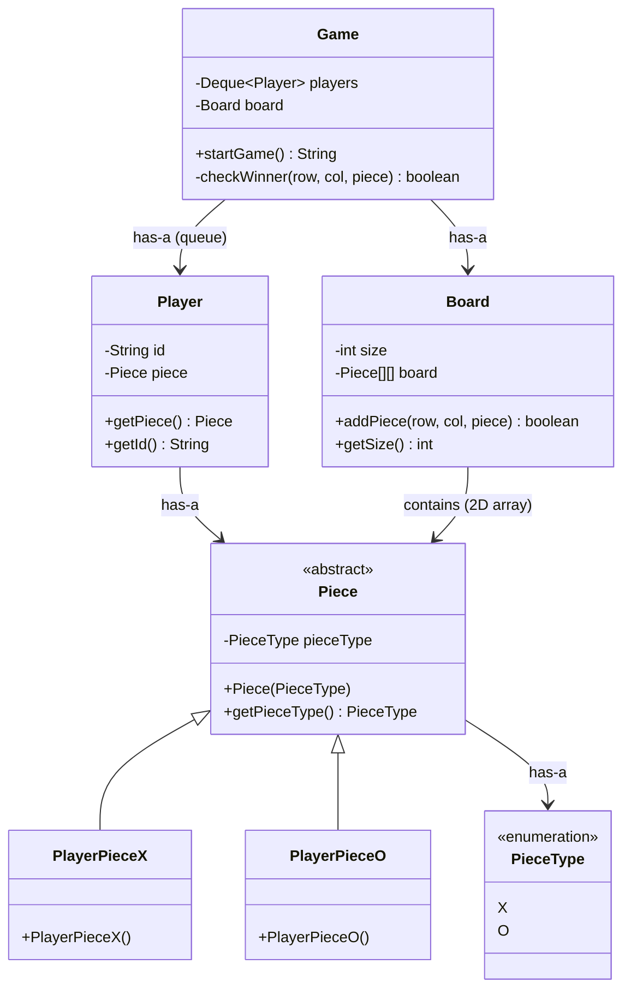
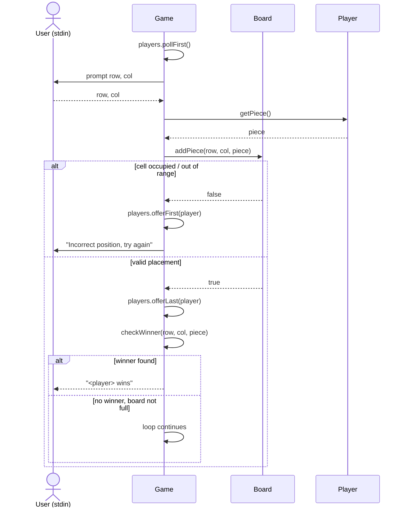

> [!tldr] What this note covers A senior-architect walkthrough of the classic Tic-Tac-Toe LLD problem: requirement gathering, object identification, class design (`Piece` → `PlayerPieceX` / `PlayerPieceO`, `Board`, `Player`, `Game`), turn management via a queue, the game loop, and an independent engineering critique (extensibility gaps, win-check complexity, production-readiness flags). No named GoF pattern is explicitly invoked in the source transcript — the design leans on **inheritance + dynamic dispatch** for piece extensibility. Where a pattern _could_ clean this up further, it's flagged separately in the critique section, not presented as "what the video did."

---

## 1. Requirement Gathering

Before touching a class diagram, the source pins down what "the game" actually needs to support — this is the step junior candidates skip and senior candidates lead with.

**Functional requirements**

- Two (or more) players take turns placing a piece on a board.
- A player wins when their piece occupies an entire row, column, or diagonal.
- The game ends either on a win or when the board is full (draw).

**Extensibility requirements (the interesting part)**

- The board should not be hardcoded to 3×3 — it should support **N×N**.
- The game should not be hardcoded to 2 players/2 symbols (X/O) — it should support **N players / N symbols**.
- Adding a new symbol (say, a "$" piece for a third player) should require _adding_ a class, not _editing_ existing ones.

> [!info] Why this matters Every downstream design decision — the abstract `Piece` class, the `PieceType` enum being decoupled from behavior, the board being sized dynamically — exists **only** because of this extensibility requirement. If the problem statement had said "always exactly 2 players, always 3×3," half of this design would be over-engineering. Senior interviewers are explicitly listening for whether you ask "does this need to scale to N?" before you commit to a rigid model.

---

## 2. Object Identification

|Object|Responsibility|Why it's a separate object|
|---|---|---|
|`Piece` (abstract)|Represents a playable symbol and its `PieceType`|Pulling this out (instead of using a raw `char` or `enum` on `Player`) is what makes "add a new symbol" an _extension_, not an _edit_|
|`PlayerPieceX`, `PlayerPieceO`|Concrete pieces for X and O|Each new symbol = one new subclass, zero changes to `Board`, `Player`, or `Game`|
|`Board`|Holds `size` and a `size × size` grid of `Piece`|Owns placement + validation of "is this cell free" — this logic shouldn't leak into `Game`|
|`Player`|Holds an `id`/name and a reference to their `Piece`|Decouples "who is playing" from "what symbol they play with"|
|`Game`|Owns the `Queue<Player>` and the `Board`; runs the turn loop and win-check|The orchestrator — the only class that knows the _sequence_ of the game|

---

## 3. Class Design & the "Why" Behind Each Decision

### 3.1 `Piece` — abstract class, not an interface

```java
public abstract class Piece {
    private PieceType pieceType;

    public Piece(PieceType pieceType) {
        this.pieceType = pieceType;
    }

    public PieceType getPieceType() {
        return pieceType;
    }
}
```

**Why abstract class over interface here:** `Piece` needs to hold **state** (`pieceType`) that every subclass shares, plus a constructor that forces that state to be set correctly. An interface can't carry instance state or a constructor — this is the same abstract-class-vs-interface tradeoff already internalized from the Observer/Decorator sessions: _shared state + partial behavior + enforced construction → abstract class; pure contract → interface._

```java
public class PlayerPieceX extends Piece {
    public PlayerPieceX() {
        super(PieceType.X);
    }
}

public class PlayerPieceO extends Piece {
    public PlayerPieceO() {
        super(PieceType.O);
    }
}
```

Each subclass does exactly one thing in its constructor: call `super()` with its fixed `PieceType`. This is the extension point — a third player wanting `$` means writing `PlayerPieceDollar extends Piece { super(PieceType.DOLLAR); }` and nothing else changes.

> [!info] Reinforcing the mechanism This is dynamic (runtime) polymorphism doing the actual work: `Board` and `Game` only ever reference the type `Piece`, and the JVM resolves the correct subclass behavior at runtime via method overriding. That's precisely what lets you add `PlayerPieceDollar` later without touching a single line in `Board` or `Game` — the base type is the seam. ([source](https://glasp.co/discover?url=www.educative.io/courses/grokking-the-low-level-design-interview-using-ood-principles/polymorphism))

### 3.2 `Board` — owns size and grid, not game logic

```java
public class Board {
    private int size;
    private Piece[][] board;

    public Board(int size) {
        this.size = size;
        this.board = new Piece[size][size];
    }

    public boolean addPiece(int row, int col, Piece piece) {
        if (row < 0 || row >= size || col < 0 || col >= size || board[row][col] != null) {
            return false;
        }
        board[row][col] = piece;
        return true;
    }

    public int getSize() {
        return size;
    }

    public Piece[][] getBoard() {
        return board;
    }
}
```

**Why `addPiece` returns `boolean` instead of throwing:** an invalid move (occupied cell, out-of-range) is an **expected, recoverable branch of the game loop** — the player just needs to be asked again. Using an exception for normal control flow here would be a code smell (see [Critique](https://claude.ai/chat/3db2da81-ec53-4c2f-b321-ff508134a02b#8-senior-architect-critique)). A `boolean` return keeps the failure path cheap and keeps `Board` ignorant of _why_ the game cares about the failure — it just reports fact, `Game` decides what to do about it.

### 3.3 `Player` — identity + assigned piece

```java
public class Player {
    private String id;
    private Piece piece;

    public Player(String id, Piece piece) {
        this.id = id;
        this.piece = piece;
    }

    public Piece getPiece() {
        return piece;
    }

    public String getId() {
        return id;
    }
}
```

Deliberately thin. `Player` doesn't know about the board, doesn't know about turns, doesn't know about winning — it's a value holder. This is a **Single Responsibility** call: identity/ownership lives here, orchestration lives in `Game`.

### 3.4 `Game` — the orchestrator

```java
public class Game {
    private Deque<Player> players;
    private Board board;

    public Game(List<Player> playerList, int boardSize) {
        this.players = new ArrayDeque<>(playerList);
        this.board = new Board(boardSize);
    }

    public String startGame() {
        boolean winner = false;
        while (!winner && !isBoardFull()) {
            Player currentPlayer = players.pollFirst();          // dequeue from front
            int row = readInput("row");
            int col = readInput("col");

            boolean placed = board.addPiece(row, col, currentPlayer.getPiece());
            if (!placed) {
                players.offerFirst(currentPlayer);                // retry: back to the FRONT
                System.out.println("Incorrect position, try again.");
                continue;
            }

            players.offerLast(currentPlayer);                     // valid move: back of the LINE

            if (checkWinner(row, col, currentPlayer.getPiece())) {
                return currentPlayer.getId();
            }
        }
        return null; // draw
    }
    // checkWinner(), isBoardFull() below
}
```

---

## 4. Class Diagram



---

## 5. Turn Management — Why a `Deque`, Not a Plain `List`

This is the one non-obvious data-structure decision in the whole design, and it's worth internalizing as a **transferable pattern**, not just a tic-tac-toe trick.

**The requirement hiding here:** on each turn you need to (a) remove whoever's turn it is from the _front_, and (b) put them back at the _end of the line_ — but which end depends on whether their move was valid.

|Move outcome|Where the player goes back|Why|
|---|---|---|
|**Valid move**|Back of the queue (`offerLast`)|They've had their turn; wait for everyone else before going again — normal round-robin|
|**Invalid move** (occupied cell)|Front of the queue (`offerFirst`)|They haven't actually taken a turn yet — re-prompt them immediately without disrupting the other players' order|

> [!info] The transferable principle Whenever "the same actor needs to conditionally re-enter a rotation at _either_ end depending on outcome," reach for a **double-ended queue**, not a `List` + manual index juggling. A `List` would force you to track a separate "current turn" pointer and special-case wraparound; a `Deque` makes both branches an O(1) call (`pollFirst`, `offerFirst`, `offerLast`) with no index bookkeeping at all. This is the same class of reasoning as the Manager/Repository checklist already built — the question is "does the _shape_ of the required operations match a structure I already have, before I hand-roll one."

---

## 6. Game Loop — Sequence Diagram

A sequence diagram is the right tool here specifically because the interesting behavior in this problem is **the order of interactions across a loop with two branches** (valid move vs. invalid move) — that's exactly what a sequence diagram is built to make explicit, showing each actor's lifeline and the messages exchanged between them over time. ([source](https://glasp.co/discover?url=www.educative.io/courses/grokking-the-low-level-design-interview-using-ood-principles/sequence-diagram))



---

## 7. Win-Check Logic (As Implemented)

The source implementation checks the row, column, and both diagonals that pass through the **just-played** cell — not the entire board — which is already a reasonable micro-optimization: no need to rescan cells that couldn't have changed.

```java
private boolean checkWinner(int row, int col, Piece piece) {
    boolean rowWin = true, colWin = true, diagWin = true, antiDiagWin = true;

    for (int i = 0; i < board.getSize(); i++) {
        if (board.getBoard()[row][i] != piece) rowWin = false;
        if (board.getBoard()[i][col] != piece) colWin = false;
        if (board.getBoard()[i][i] != piece) diagWin = false;
        if (board.getBoard()[i][board.getSize() - 1 - i] != piece) antiDiagWin = false;
    }
    return rowWin || colWin || diagWin || antiDiagWin;
}
```

This is **O(N)** per move (N = board size) — fine for interview purposes, but flagged explicitly in the source as improvable, with a pointer toward the same trick used in N-Queens: instead of rescanning a row/column/diagonal on every move, maintain **running counters** per row, per column, and per diagonal, incremented on each placement, so a win-check becomes an **O(1)** counter comparison.

---

## 8. Senior Architect Critique

> [!warning] This section is independent analysis, not a transcription of the source — it's the "would this survive a design review" pass.

**1. `checkWinner` is O(N) per move when it could be O(1).** As noted above — swap the scan for four running-count arrays (`rowCount[N]`, `colCount[N]`, one `diagCount`, one `antiDiagCount`), incremented/decremented on placement per player. This is the single biggest algorithmic upgrade available and is a good "how would you optimize this" follow-up to have ready.

**2. `addPiece` returning `boolean` is fine for one failure mode, brittle for many.** Right now there's exactly one reason a placement can fail (occupied/out-of-range), so a boolean is proportionate. The moment you add a second failure mode (e.g., "game already over," "not your turn"), a bare `boolean` forces the caller to guess _why_ it failed. At that point, switch to a small `PlacementResult` enum or a checked outcome object — don't reach for exceptions-as-control-flow, and don't stack booleans/error codes either.

**3. `PieceType` enum decoupled from `Piece` subclass is slightly redundant, but intentionally so.** You could argue `PieceType` is redundant once you have `PlayerPieceX`/`PlayerPieceO` as distinct types (`instanceof` could substitute). It's kept anyway because comparing pieces via `getPieceType() == getPieceType()` is cheaper and clearer than `instanceof` chains, and it gives you a single place to add display/serialization metadata later (e.g., a symbol character, a color) without touching the class hierarchy. Worth being able to defend this tradeoff out loud in an interview rather than presenting it as free.

**4. Extensibility claim is partially unproven: N-player win conditions aren't actually generalized.** The design _supports_ adding a third piece type and a third player structurally (new subclass, bigger `Deque`), but the win-check as written still assumes "does one player fully occupy a row/col/diagonal" — which is the correct win condition regardless of player count, so this one actually holds up. Where it would **not** hold up without further work: board sizes where "3 in a row" (not "N in a row") is still the win condition — a proper NxN generalization typically wants a _configurable_ win-length, not "always full row/col/diag."

**5. No thread-safety story, and this matters more than it looks.** `Deque<Player>` and the `Piece[][]` grid are both mutated with no synchronization. Fine for a single-threaded console game; a real interview follow-up ("what if this becomes a server handling concurrent games / concurrent moves from the same game") should surface a TOCTOU-style race identical in shape to the one already flagged in earlier LLD sessions: `board.addPiece()`'s "is this cell free" check and the actual write are not atomic under concurrency. The fix is the same class of fix as before — hold a lock scoped to the cell/board for the check-and-set, not just around the read.

**6. Input validation lives partly in `Board`, partly implied in `Game` — should be consolidated.** `Board.addPiece` validates bounds and occupancy; nothing validates that `row`/`col` are even parseable integers before they reach `Board`. In production code this belongs at the boundary (right where user input enters the system), not scattered across the domain object.

---

## 9. Key Transferable Principles (for the running LLD playbook)

- **Extensibility requirement → abstract base type over raw enums/chars.** If "add a new X without editing existing code" is a requirement, that's your signal to introduce a base type (`Piece`) instead of a primitive tag.
- **Same-actor, conditional-re-entry-at-either-end rotation → reach for `Deque`, not `List` + index math.**
- **A `boolean` return is proportionate to exactly one failure mode.** The moment a second failure mode appears, upgrade to an explicit result type — don't let booleans multiply.
- **Optimize the hot path only after correctness, and know the O(1) counter trick for win/line-completion checks** — it generalizes beyond tic-tac-toe to any "N-in-a-row" or bingo-style completion check.
- **"Extensible to N" is a claim you have to actually trace through every method, not just the class hierarchy** — structural extensibility (new subclasses) and behavioral extensibility (win logic, board rules) can diverge, as seen in point 4 above.

