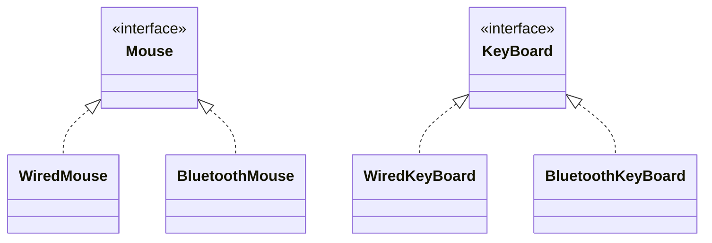

> [!tldr] Class should depend on interfaces rather than concrete classes.



> [!caution]

```
class MacBook {

    private final WiredKeyboard keyboard;
    private final WiredMouse mouse;

    public MacBook() {
        keyboard = new WiredKeyboard();
        mouse = new WiredMouse();
    }
}
```

Here, I am using concrete classes. In future, if i need to update the keyboard/mouse type, I'll need to update the code.

> [!success]

```
class MacBook {

    private final Keyboard keyboard;
    private final Mouse mouse;

    public MacBook(Keyboard keyboard, Mouse mouse) {
        this.keyboard = keyboard;
        this.mouse = mouse;
    }
}
```

Now, here we use interface itself and can pass keyboard as WiredKeyboard/BluetoothKeyboard & same for mouse.