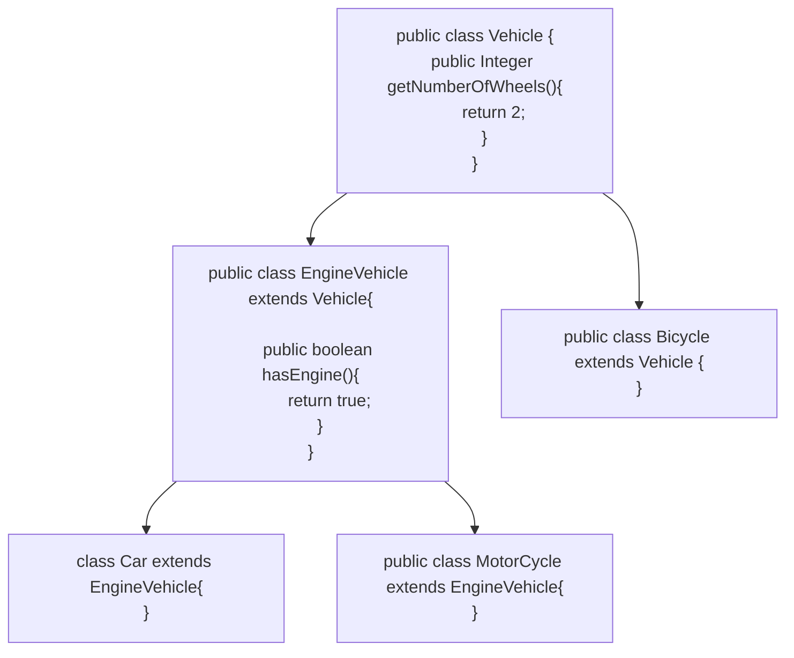

> [!tldr] 
> If Class B is subtype of Class A, then we should be able to replace object of A with B without breaking the behaviour of the program.

***Subclass should extend the capability of parent class NOT narrow it down***

> [!caution]

```
interface Bike {
    void turnOnEngine();
    void accelerate();
}

class MotorCycle implements Bike {
    boolean isEngineOn;
    int speed;

    public void turnOnEngine() {
        //turn on the engine!
        isEngineOn = true;
    }

    public void accelerate() {
        //increase the speed
        speed = speed + 10;
    }
}

class Bicycle implements Bike {

    public void turnOnEngine() {
        throw new AssertionError("there is no engine");
    }

    public void accelerate() {
        //do something
    }
}
```


Here, class `Bicycle` narrows down the functionality of `Bike` by throwing error in `turnOnEngine` 

> [!success]


